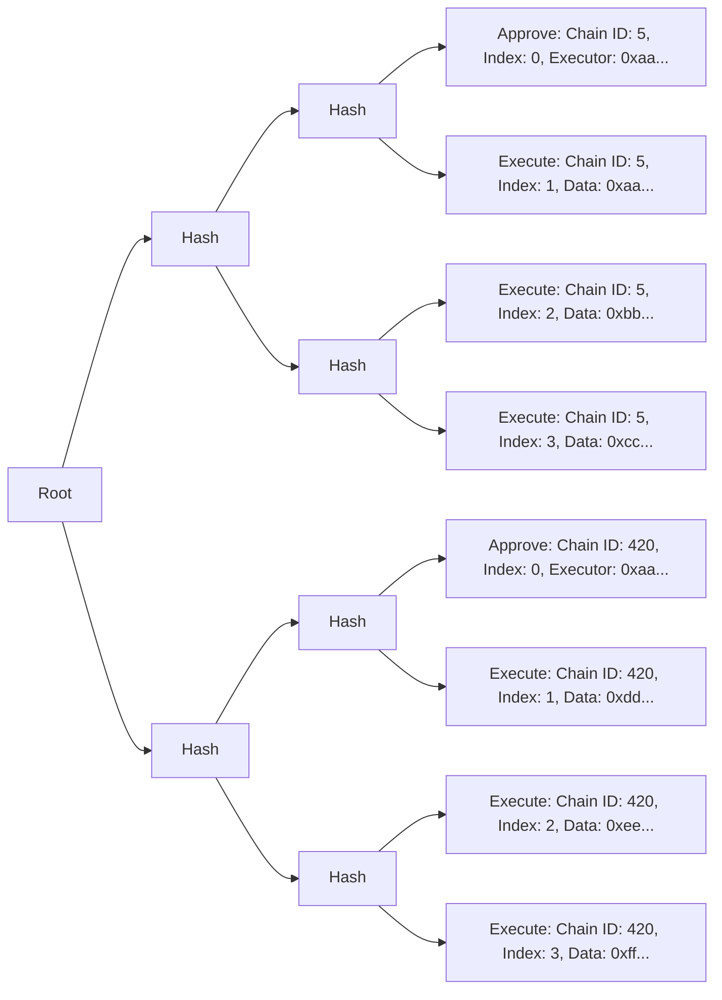

# Architecture Overview

This guide will describe how Sphinx works. There's no information in this guide about how to _use_ Sphinx; it's just intended for readers who are curious about Sphinx's architecture.

## Table of Contents

- [Goals](#goals)
- [Overview](#overview)
- [Merkle Tree Architecture](#merkle-tree-architecture)
- [Further Reading](#further-reading)

## Goals

Sphinx aims to make the smart contract deployment process more secure, transparent, and efficient.

* **Secure**: It's impossible to execute anything that the Gnosis Safe owners have not explicitly approved. This is crucial because of the mission-critical nature of smart contract deployments, where subtle mistakes can cause significant issues after a system has been deployed.
* **Transparent**: Sphinx offers greater transparency into the deployment process by providing a preview containing all of the deployment transactions. Each deployment has a unique identifier, making it obvious if a deployment has changed in any way.
* **Efficient**: Developers can approve arbitrarily large deployments across an arbitrary number of chains by signing a single meta transaction. Once a deployment is approved, it can be executed trustlessly by a third party. Developers don't need native gas tokens on any chain to fund their deployments.

## Overview

We wanted teams to be able to approve deployments from their multisig wallet, so we built our protocol on top of Gnosis Safe. We chose Gnosis Safe because it's a battle-tested smart contract wallet many teams use to manage their protocols.

Our primary on-chain component is a [Gnosis Safe Module](https://docs.safe.global/safe-smart-account/modules). The executor of the deployment submits transactions on the module, which verifies that the Gnosis Safe owners have approved the transactions, and then submits the transactions on the Gnosis Safe. We decided to build a module because this allows teams to use Sphinx without transferring ownership of their smart contracts away from their Gnosis Safe.

To facilitate this trustless execution process, Sphinx uses a custom mechanism to verify the signatures of the Gnosis Safe owners. When a team approves a deployment, they sign its unique identifier using a meta transaction. This unique identifier is the root of a [Merkle tree](https://en.wikipedia.org/wiki/Merkle_tree).

The Merkle tree's leaves contain all the transaction data for the deployment across every chain where it will be executed. Each leaf in the Merkle tree represents a single action on a single chain. We use a Merkle tree because it provides an efficient and secure way to execute large deployments across many chains trustlessly.

After the Gnosis Safe owners have signed the deployment's Merkle root, the executor can execute the deployment on-chain. The executor submits the Merkle leaves to the Sphinx Module, which verifies that each leaf corresponds to the Merkle root signed by the Gnosis Safe owners. Then, the module forwards the transactions to the Gnosis Safe, where they're executed.

It's impossible for the executor to modify the Merkle leaves or submit them in the wrong order.

## Merkle Tree Architecture

Each leaf in the Merkle tree represents a single action on a single chain. There are two types of leaves in a standard deployment:

- **`APPROVE`**: Approve a new deployment. An `APPROVE` leaf must be submitted on-chain before the deployment can be executed.
- **`EXECUTE`**: Execute a transaction in the deployment.

A diagram of a typical Merkle tree is shown below (displayed from left to right to reduce horizontal space):

This Merkle tree contains a deployment on two chains. There are three transactions to execute on each chain.

You'll notice that the "Approve" leaves contain an "executor" field. The executor is an address with sole permission to execute the deployment. The executor will be Sphinx's backend if you use the DevOps Platform.

You'll also notice that each Merkle leaf has an `index`. The Merkle leaves must be executed in ascending order according to their indexes on any given chain.

## Further Reading

If you'd like to learn more about Sphinx's architecture, we recommend reading our [specifications](https://github.com/sphinx-labs/sphinx/blob/main/README.md#specifications).
