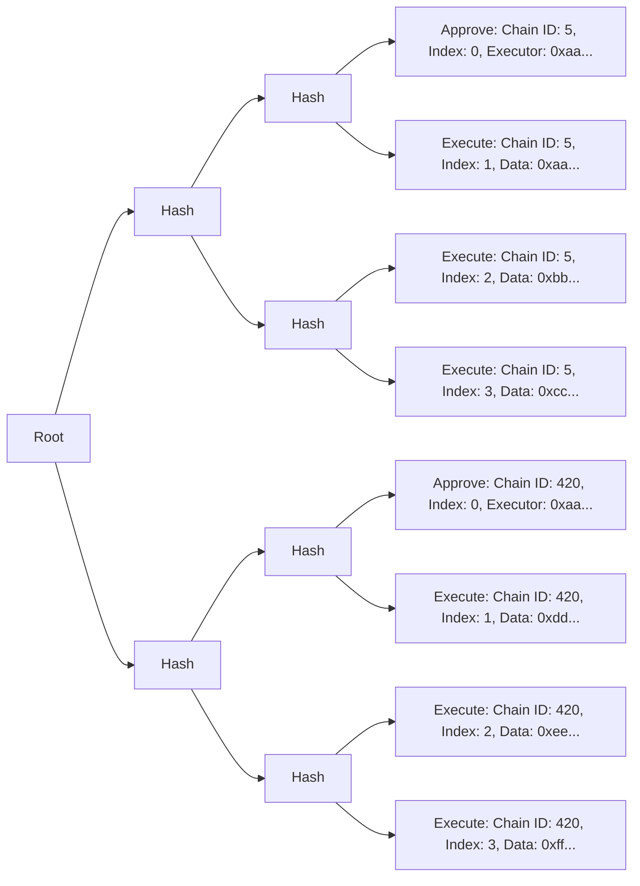

# How Sphinx Works

This guide assumes that you've familiarized yourself with the key features of Sphinx, which are in the [main README](TODO(md-end)).

## Table of Contents

TODO(md-end)

## Goals

Sphinx aims to make the smart contract deployment process more secure and efficient.

* **Secure**: It's impossible to execute anything that the Gnosis Safe owners have not explicitly approved. This is crucial because of the mission-critical nature of smart contract deployments, where subtle changes in a deployment can cause significant issues after a system has been deployed.
* **Efficient**: Developers can approve arbitrarily large deployments across an arbitrary number of chains by signing a single meta transaction. Once a deployment is approved, it can be executed trustlessly by a third party. Developers don't need native gas tokens on any chain to fund their deployments.

## Architecture Overview

We wanted teams to be able to approve deployments from their multisignature wallet, so we built our protocol on top of Gnosis Safe. We chose Gnosis Safe because it's a battle-tested smart contract wallet that many teams use to manage their protocols.

Our primary on-chain component is a [Gnosis Safe Module](https://docs.safe.global/safe-smart-account/modules). The executor of the deployment submits transactions on the module, which verifies that the transactions have been approved by the Gnosis Safe owners, then submits the transactions on the Gnosis Safe. We decided to build a module because this allows teams to use Sphinx without transferring ownership of their smart contracts away from their Gnosis Safe.

To facilitate this trustless execution process, Sphinx uses a custom mechanism to verify the signatures of the Gnosis Safe owners. When a team approves a deployment, they sign the deployment's unique identifier using a meta transaction. This unique identifier is the root of a [Merkle tree](https://en.wikipedia.org/wiki/Merkle_tree).

The Merkle tree's leaves contain all of the transaction data for the deployment, across every chain where it will be executed. Each leaf in the Merkle tree represents a single action on a single chain. We use a Merkle tree because it provides an efficient and secure way to trustlessly execute large deployments across many chains.

After the Gnosis Safe owners have signed the Merkle root of a deployment, it can be executed on-chain. The executor submits the Merkle leaves to the Sphinx Module, which verifies that each leaf corresponds to the Merkle root signed by the Gnosis Safe owners. Then, the module forwards the transactions to the Gnosis Safe, where they're executed.

It's impossible for the executor to modify the leaves or submit them in the wrong order.

## Merkle Tree Architecture

Each leaf in the Merkle tree represents a single action on a single chain. There are two types of leaves in a standard deployment:

- **`APPROVE`**: Approve a new deployment. This must occur before the deployment can be executed.
- **`EXECUTE`**: Execute a transaction in the deployment.

A diagram of a typical Merkle tree is shown below (displayed from left to right to reduce horizontal space):

This Merkle tree contains a deployment on two chains. There are three transactions to execute on each chain.

You'll notice that the "Approve" leaves contain an "executor" field. The executor is an address with sole permission to execute the deployment. If you're using the Sphinx DevOps platform, the executor will be Sphinx's backend.

You'll also notice that each Merkle leaf has an `index`. The Merkle leaves must be executed in ascending order according to their indexes on any given chain.

## Deploying Gnosis Safe Contracts

Before Sphinx can execute a deployment on your behalf, a Gnosis Safe must exist on the target network. (Otherwise, there'd be no owners to approve the deployment!)

This section will describe the process that Sphinx uses to deploy and setup Gnosis Safe contracts on your behalf.

Sphinx uses a single transaction to:
1. Deploy a Gnosis Safe at a deterministic address.
2. Deploy its Sphinx Module at a deterministic address.
3. Enable the module within the Gnosis Safe.

This occurs via `CREATE2` using the following inputs:
* The initial Gnosis Safe owners.
* The number of Gnosis Safe owner signatures required to approve transactions.
* Data that deploys a new Sphinx Module and enables the module within the new Gnosis Safe.
* The deployer of the Gnosis Safe. This is a [Gnosis Safe Proxy Factory](TODO(md)), which is a contract developed by the Gnosis Safe team. We use a Gnosis Safe Proxy Factory deployed from [Arachnid's deterministic deployment proxy](https://github.com/Arachnid/deterministic-deployment-proxy), which is the canonical `CREATE2` factory that's deployed on hundreds of chains.

If any of these input parameters change, the address of the Gnosis Safe will change too.

We use `CREATE2` to make it possible for anybody to permissionlessly submit this transaction on behalf of the Safe owners without requiring their signatures. If the Safe owners are confident that their Safe has been deployed correctly at a given address on one chain, then they can be confident that a Safe at the **same address** on any other chain has also been deployed correctly.

If you'd like to see exactly how the Gnosis Safe deployment process works, see [TODO(md) `SphinxModuleProxy` unit test file](https://github.com/sphinx-labs/sphinx/blob/develop/packages/contracts/test/SphinxModuleProxy.t.sol#L101-L167).

## Further Reading

If you'd like to learn more about Sphinx's architecture, we recommend reading our [specifications](TODO(md-end)).
