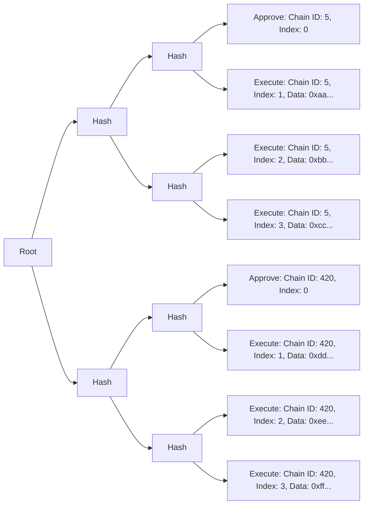

# Introduction

Sphinx is a protocol that aims to make the smart contract deployment process more secure, transparent, and efficient. This document provides an overview of Sphinx to serve as context for the rest of the specification.

## Goals

* **Secure**: Deployments with Sphinx are tamper-proof. This is crucial because of the mission-critical nature of smart contract deployments, where subtle changes in a deployment can cause significant issues after a system has been deployed.
* **Transparent**: Sphinx offers greater transparency by providing a verifiable hash of each deployment. Users and other stakeholders can verify the transactions in a deployment before it's executed.
* **Efficient**: Developers can approve arbitrarily large deployments across an arbitrary number of chains by signing the deployment's unique identifier using a meta transaction. Once it's approved, Sphinx's backend will trustlessly execute the deployment on every chain. Developers don't need native gas tokens on any chain.

## Architecture Overview

Most teams use a multisig wallet to approve permissioned actions. We wanted teams to be able to approve deployments from their multisig as well, so we built our protocol on top of Gnosis Safe. Our primary on-chain component is a [Safe Module](TODO(end)), which allows us to use our own signature verification mechanism that's designed for deployments (details below).

When a set of Gnosis Safe owners approve a deployment with Sphinx, they sign a 32-byte hash of the deployment using a meta transaction. This hash is the root of a [Merkle tree](TODO(end)). We use a Merkle tree because it provides an efficient and secure way to trustlessly execute large deployments across many chains.

The account that executes the deployment must submit a Merkle proof that proves the Gnosis Safe owners have signed the Merkle root. It's impossible for the executor to submit anything that the Gnosis Safe owners have not explicitly approved.

Each leaf in the Merkle tree is a single action on a single chain. There are two types of actions:
- **Approve**: Approve a new deployment on a chain.
- **Execute**: Execute a transaction in the deployment.

A deployment must be approved on a chain before it can be executed.

A diagram of a typical Merkle tree is shown below (displayed from left to right to reduce horizontal space):

This Merkle tree contains a deployment on two chains. There are three transactions for each deployment.

You'll notice that each Merkle leaf has an index. On any given chain, the Merkle leaves must be executed in ascending order according to their indexes.
