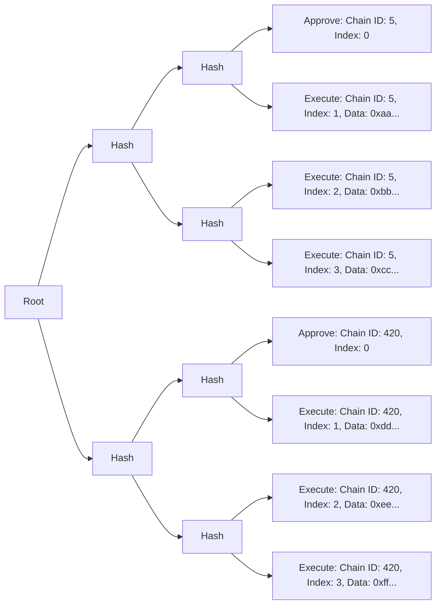

# Introduction

Sphinx is a protocol that aims to make the smart contract deployment process more secure, transparent, and efficient. This document provides an overview of Sphinx to serve as context for the rest of the specification.

## Goals

* **Secure**: Deployments with Sphinx are tamper-proof. This is crucial because of the mission-critical nature of smart contract deployments, where subtle changes in a deployment can cause significant issues after a system has been deployed.
* **Transparent**: Sphinx offers greater transparency by providing a verifiable hash of each deployment. Users and other stakeholders can verify the transactions in a deployment before it's executed.
* **Efficient**: Developers can approve arbitrarily large deployments across an arbitrary number of chains by signing a single meta transaction. Once a deployment is approved, it can be executed trustlessly by a third party. Developers don't need native gas tokens on any chain to fund their deployments.

## Architecture Overview

We wanted teams to be able to approve deployments from their multisignature wallet, so we built our protocol on top of Gnosis Safe. Our primary on-chain component is a [Gnosis Safe Module](TODO(end)). The executor of the deployment submits transactions on the module, which verifies that the transactions have been approved by the Gnosis Safe owners, then submits the transactions on the Gnosis Safe.

To facilitate this trustless execution process, Sphinx uses a custom mechanism to verify the signatures of the Gnosis Safe owners. When a team approves a deployment, they sign the deployment's unique identifier using a meta transaction. This unique identifier is the root of a [Merkle tree](TODO(end)). The Merkle tree's leaves contain all of the transaction data for the deployment, across every chain where it will be executed. We use a Merkle tree because it provides an efficient and secure way to trustlessly execute large deployments across many chains.

Each leaf in the Merkle tree is a single action on a single chain. The module verifies that each leaf submitted by the executor corresponds to the Merkle root signed by the Gnosis Safe owners. It's impossible for the executor to submit anything that the Gnosis Safe owners have not explicitly approved.

## Merkle Tree Architecture

There are two types of Merkle leafs:
- **Approve**: Approve a new deployment on a chain.
- **Execute**: Execute a transaction in the deployment.

A deployment must be approved on a chain before it can be executed.

A diagram of a typical Merkle tree is shown below (displayed from left to right to reduce horizontal space):

This Merkle tree contains a deployment on two chains. There are three transactions for each deployment.

You'll notice that each Merkle leaf has an index. On any given chain, the Merkle leaves must be executed in ascending order according to their indexes.

## Supported Gnosis Safe Versions

Sphinx supports two versions of Gnosis Safe, which each have two types of Gnosis Safe contracts: one for L1 and one for L2. The full list is below:
- [Gnosis Safe v1.3.0](TODO(end)):
  - [`GnosisSafe.sol`](TODO(end)): L1 Gnosis Safe
  - [`GnosisSafeL2.sol`](TODO(end)): L2 Gnosis Safe
- [Gnosis Safe v1.4.1](https://github.com/safe-global/safe-contracts/tree/192c7dc67290940fcbc75165522bb86a37187069):
  - [`Safe.sol`](TODO(end)): L1 Gnosis Safe
  - [`SafeL2.sol`](TODO(end)): L2 Gnosis Safe
