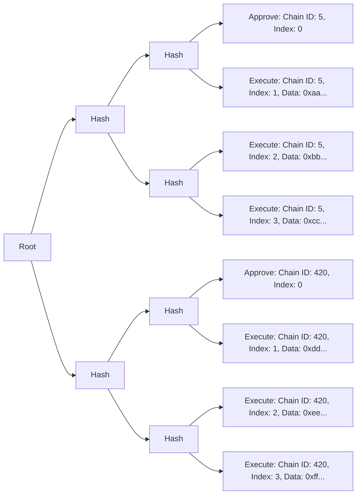
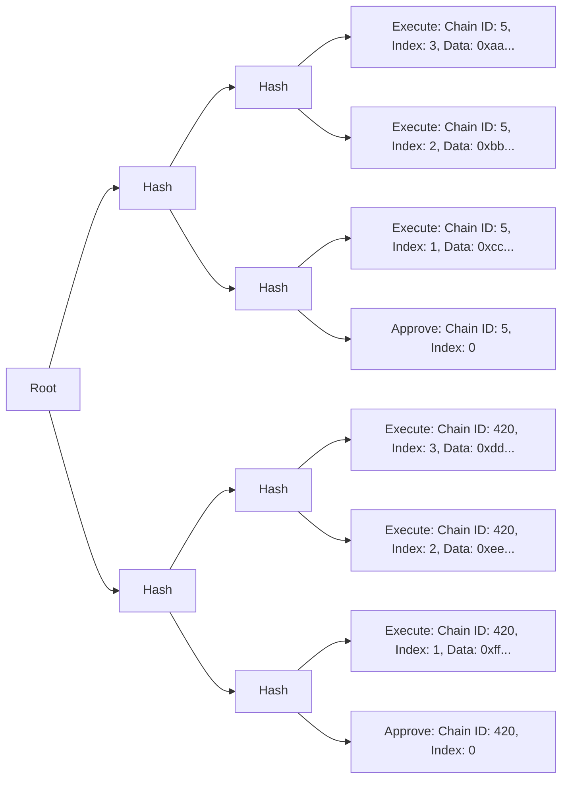

# Sphinx Merkle Tree
Sphinx uses a custom Merkle tree data structure to allow teams to approve arbitrarily large deployments across an arbitrary number of networks via off-chain signatures, and then allow those transactions to be trustlessly executed via their Gnosis Safe by a third party relayer. This document outlines the architecture and content of the Sphinx Merkle tree.

**Vocabulary notes**:
- We use the term `relayer` to refer to the entity that submits the transactions to execute a Sphinx Merkle tree on-chain via a Sphinx Module proxy.
- We use the term `executor` to refer to the exact account that needs to submit the transactions to the `SphinxModuleProxy` to complete a deployment on-chain.

### Relevant Files
- Standard Merkle Tree Generation Logic: [`merkle-tree.ts`](TODO(end))
- Unit tests: [`merkle-tree.spec.ts`](TODO(end))

## Table of Contents
- [Merkle Tree Architecture](#merkle-tree-architecture)
- [Merkle Leaf Types](#merkle-leaf-types)
  - [`APPROVE` Leaf Data](#approve-leaf-data)
  - [`EXECUTE` Leaf Data](#execute-leaf-data)
- [Sphinx Merkle Tree Standard Invariants](#sphinx-merkle-tree-standard-invariants)
- [Sphinx Merkle Tree Generation Standard Implementation](#sphinx-merkle-tree-generation-standard-implementation)
  - [Input](#input)
  - [Output](#output)
- [Function-Level Invariants](#function-level-invariants)
- [Dependencies](#dependencies)

## Merkle Tree Architecture

There are three types of Merkle leaves:
- **Approve**: Approve a new deployment on a chain.
- **Execute**: Execute a transaction in the deployment.
- **Cancel**: Cancel an active deployment.

A deployment must be approved on a chain before it can be executed.

A diagram of a typical Merkle tree is shown below (displayed from left to right to reduce horizontal space):

This Merkle tree contains a deployment on two chains. There are three transactions for each deployment.

You'll notice that each Merkle leaf has an index. On any given chain, the Merkle leaves must be executed in ascending order according to their indexes. Note that the Sphinx Merkle tree uses an explicit index rather than relying on the order of the leaves within the tree. This introduces some complicity in the way that Sphinx Merkle trees can be structured which we cover in the [Sphinx Merkle Tree Standard Invariants](TODO(end)) section below.

### Merkle Leaf Types

Each leaf in the Merkle tree contains the following fields:
* `uint256 chainId`: The target chain id
* `uint256 index`: The index of the leaf
* `SphinxLeafType leafType`: The type of the leaf, either `APPROVE` or `EXECUTE`. On-chain, both leaf types are represented as a [`SphinxLeaf`](https://github.com/sphinx-labs/sphinx/blob/feature/pre-audit/packages/contracts/contracts/core/SphinxDataTypes.sol#L17-L30).
* `bytes data`: Arbitrary data that is encoded based on the leaf type. We'll describe the fields of the decoded data for each leaf type below.

Each leaf in the Merkle tree represents a single action on a single chain. There are two types of actions:
- **`APPROVE`**: Approve a new deployment on a chain. This leaf must be submitted in the `approve` function on the `SphinxModuleProxy`.
- **`EXECUTE`**: Execute a transaction in the deployment. These leaves must be submitted in the `execute` function on the `SphinxModuleProxy`.

### `APPROVE` Leaf Data

The `data` field of an `APPROVE` leaf consists of the following fields, which are ABI encoded:
* `address safeProxy`: The address of the Gnosis Safe.
* `address moduleProxy`: The address of the `SphinxModuleProxy` that is coordinating the deployment.
* `uint256 merkleRootNonce`: The nonce of the Merkle root in the `SphinxModuleProxy`.
* `uint256 numLeaves`: The total number of leaves in the Merkle tree on the current chain. There must be at least one leaf (the `APPROVE` leaf).
* `address executor`: The address of the caller, which is the only account that is allowed to execute the deployment.
* `string uri`: The IPFS URI of the deployment. This contains information such as the Solidity compiler inputs, which allows the executor to verify the user's smart contracts on Etherscan. This can be an empty string if there is only a single leaf on the current network (the `APPROVE` leaf).
* `bool arbitraryChain`: If this is `true`, the Merkle root can be executed on any chain without the explicit permission of the Gnosis Safe owners. This is useful if the owners want their system to be permissionlessly deployed on new chains. By default, this is disabled, which means that the Gnosis Safe owners must explicitly approve the deployment on individual chains.

### `EXECUTE` Leaf Data

The `data` field of an `EXECUTE` leaf primarily contains data to forward to the Gnosis Safe. It consists of the following fields, which are ABI encoded:
* `address to`: The target address of the transaction. This is _not_ the address of the Gnosis Safe.
* `uint256 value`: The amount of native gas token to transfer from the Gnosis Safe to the target address. This value is not transferred from the `SphinxModuleProxy`.
* `uint256 gas`: The amount of gas that's included in the call from the `SphinxModuleProxy` to the Gnosis Safe.
* `bytes txData`: The transaction's data.
* `Enum.Operation operation`: The type of transaction to execute in the Gnosis Safe, i.e. `Call` or `DelegateCall`.
* `bool requireSuccess`: If this is `true` and the transaction in the Gnosis Safe fails, the deployment is marked as "failed" and will end immediately. If this is `false`, the deployment will continue regardless of whether the transaction fails.

### `CANCEL` Leaf Data
TODO

## Sphinx Merkle Tree Standard Invariants
Sphinx uses the custom Merkle tree structure defined above which is intended to be valid across multiple networks. It is possible to construct Sphinx Merkle trees that are invalid, only partially valid, or valid but not executable by an arbitrary relayer implementation due to their structure or content. Therefore, we impose a standard set of invariants that should be true about any Sphinx Merkle tree. We expect relayer implementations to rely on Sphinx Merkle trees following the invariants set out in this standard, and that they will refuse to execute Sphinx Merkle trees that do not follow these invariants.

Generally speaking, the goal of these invariants is to clearly define what a valid Sphinx Merkle tree looks like and to ensure that trees that appear to be valid are in fact executable on all chains they contain leaves for (unless the underlying user-defined transactions themselves fail such as if the gas specified is incorrect, the chain id is invalid, the transaction simply reverts, etc).

### 1. There must be no gaps in `index` in leaves that have the same chain ID
A Sphinx Merkle tree that contains leaves that have gaps in their index such as a set of leaves with the indexes: `[0, 1, 3, 4]` would not be executable on-chain. Therefore we impose the standard that there be no gaps in the leaf indexes on a given chain.

### 2. Merkle tree leaves must be ordered in the tree by index and chain ID ascending
Sphinx Merkle tree leaves use an explicit index value rather than an implicit value determined by the order in the tree. This is because the Sphinx Merkle tree is intended to be executed across multiple networks and not all leaves will be executed on all networks. As a result, it is possible to construct Sphinx Merkle trees that have leaves that follow various non-standard ordering schemes. These trees are executable on-chain as long as their leaves are submitted by order of their index. However, these trees may not be executable by all off-chain relayer implementations which may rely on an expected order.

For example, the following Merkle tree would be valid as long as its leaves are submitted on-chain in ascending order by their index. This is true even though the tree was constructed with the order of the leaves reversed.

Sphinx Merkle trees should follow a consistent ordering scheme to ensure they can be executed by a variety of executor implementations without issue. We impose the standard that the leaves should be ordered by index and chain ID ascending.

So for example, if we intended to run some set of transactions on Goerli (5), OP Goerli (420), and Polygon Mumbai (80001). Then the leaves are expected to be ordered with the approval leaf for Goerli first, then all of the transaction leaves on Goerli in ascending order, then the approval leaf for OP Goerli, all the transaction leaves on OP Goerli in ascending order, and so on.

### 3. Every chain ID and index combination must be unique within the tree
Since the Sphinx Merkle tree leaves contain explicit indexes, it is also possible to construct trees that contain multiple leaves with the same index value and chain ID. However, only one of the leaves would be executable on-chain. Therefore, constructing a tree with multiple leaves with the same chain ID and index would make it ambiguous to the relayer which leaf should be executed, and would result in a tree that cannot be fully executed. So we impose the standard that in a given Sphinx Merkle tree there must be at most one leaf with each chain ID and index combination.

### 4. There must be exactly one approval leaf or cancel leaf per chain
Since Sphinx Merkle trees can contain an arbitrary set of leaves, it is possible to construct a single tree that contains `APPROVE` or `CANCEL` leaves that approve or cancel multiple separate deployments on a single chain. However, this leads to an ambiguous situation for the relayer where it is unclear which deployment should be approved or canceled.

Additionally, The `SphinxModuleProxy` does not support both canceling an existing deployment and approving a new deployment in the same tree, therefore any tree that contains both a `CANCEL` and `APPROVE` leaf for a given chain would not be executable on that chain. So we impose the standard, that in a given Sphinx Merkle tree there should be exactly one `APPROVE` or `CANCEL` leaf per chain.

If the `arbitraryChain` field is set to true, then we consider this approval leaf to apply to all chains. Therefore if `arbitraryChain` = true, then there should be exactly one `APPROVE` leaf in the entire tree and no `CANCEL` leaves.

## Sphinx Merkle Tree Generation Standard Implementation
We provide a standard implementation for generating Sphinx Merkle trees that adhere to the above invariants. This implementation is used by the official Sphinx Foundry plugin.

### Input
Accepts an object where the keys are canonical chain ids and the values are deployment data objects which contain all of the necessary info to assemble a SphinxMerkleTree. See the [inline documentation](TODO(end)) for exact details on the input data. The Sphinx Merkle tree generation function should be agnostic to the source of the transaction data so it can be used to assemble a tree based on transactions generated from any scripting framework (i.e Foundry, Hardhat Ignition, some arbitrary future framework).

### Output
A Sphinx Merkle tree that follows the above specification and invariants. See the [inline documetation](TODO(end)) for the exact details of the output data structure.

## Function-Level Invariants
We export three separate functions `makeSphinxLeaves`, `makeSphinxMerkleTreeFromLeaves`, and `makeSphinxMerkleTree`. We provide three separate functions for convenience and modularity to enable testing. However, for this specification and the below invariants we assume the use of the `makeSphinxMerkleTree`. We *only* recommend using that function when generating Sphinx Merkle trees in production and therefore only consider it to satisfy the invariants listed above.

### It is impossible to specify multiple `NetworkDeploymentData` objects for a given network
The Merkle tree generation logic relies on the fact that it is not possible to submit multiple `NetworkDeploymentData` objects to guarantee that there is exactly one `APPROVE` or `CANCEL` leaf ([4](#4-there-must-be-exactly-one-approval-leaf-or-cancel-leaf-per-chain-4)).

### The index of all leaves is generated internally and cannot be specified by the input data
The Merkle tree generation logic relies on calculating the indexes for all leaves internally to guarantee that the leaves are ordered properly ([2](#2-merkle-tree-leaves-must-be-ordered-in-the-tree-by-index-and-chain-id-ascending)) and that there are no index gaps ([1](#1-there-must-be-no-gaps-in-index-in-leaves-that-have-the-same-chain-id)).

This invariant works together with the above invariant, it is not possible to specify multiple `NetworkDeploymentData` objects for a given network, to ensure each index + chain ID combination is unique ([3](#3-every-chain-id-and-index-combination-must-be-unique-within-the-tree-3)).

## Dependencies
The Sphinx standard Merkle tree generation logic makes calls to two popular external libraries. We use `ethers` version 6.7.0 to handle ABI encoding tree leaf `data`, and we use `@openzeppelin/merkle-tree` to assemble the Merkle tree. We test that interactions with these libraries work properly in our higher-level unit tests which ensure that Merkle trees generated by this logic have data that is encoded properly and that they are executable on-chain. However, we do not test the internals of these libraries and instead rely on the assumption that they are robust and bug-free.
