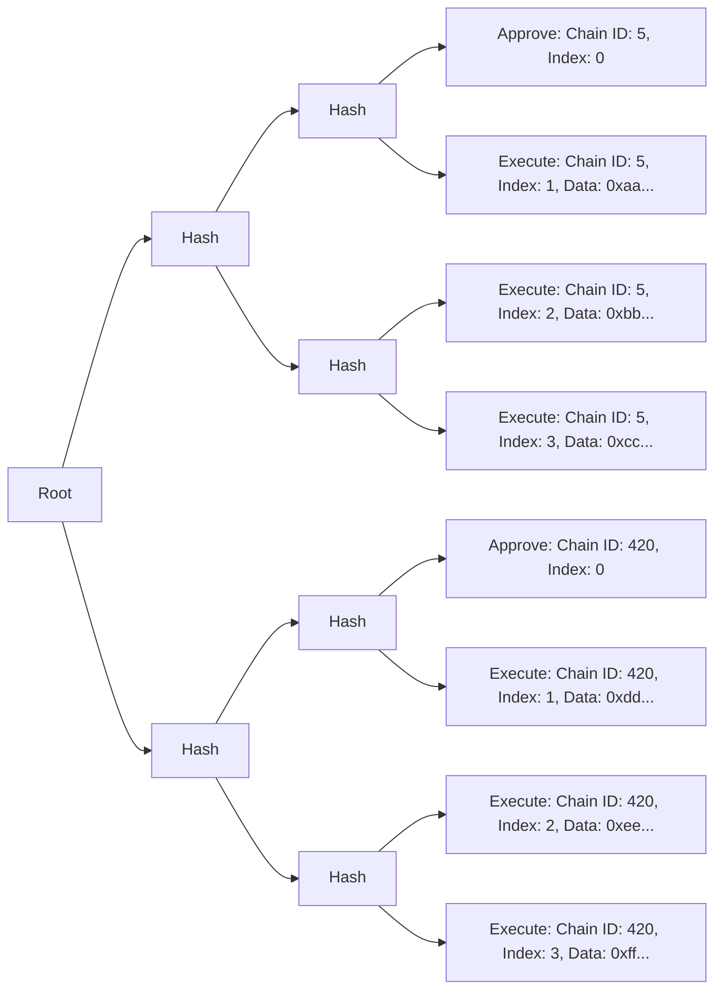

# Sphinx Merkle Tree
Sphinx uses a custom Merkle tree data structure to allow teams to approve arbitrarily large deployments across an arbitrary number of networks via an off-chain signature. Those deployments can then be trustlessly executed via their Gnosis Safe by a third-party executor using their `SphinxModuleProxy`. This document outlines the architecture and content of the Sphinx Merkle tree.

**Vocabulary notes**:
- An _executor_ is the third-party system responsible for executing deployments using a Sphinx Merkle tree and signed root.
- A _valid Merkle tree_ is a Sphinx Merkle tree that conforms to the [Merkle Tree Invariants](#high-level-merkle-tree-invariants).
- A leaf _index_ refers to the explicit `index` field on the `SphinxLeaf` data type. It does _not_ refer to the leaf's position within the tree. [^1]

### Relevant Files
- Merkle Tree Generation Logic: [`merkle-tree.ts`](https://github.com/sphinx-labs/sphinx/blob/feature/pre-audit/packages/contracts/src/merkle-tree.ts)
- Unit tests: [`merkle-tree.spec.ts`](https://github.com/sphinx-labs/sphinx/blob/feature/pre-audit/packages/contracts/test/mocha/merkle-tree.spec.ts)

## Table of Contents
- [Merkle Tree Architecture](#merkle-tree-architecture)
- [Merkle Leaf Types](#merkle-leaf-types)
  - [`APPROVE` Leaf Data](#approve-leaf-data)s
  - [`EXECUTE` Leaf Data](#execute-leaf-data)
- [Valid Merkle Trees](#valid-merkle-trees)
- [High-Level Merkle Tree Invariants](#high-level-merkle-tree-invariants)
- [Merkle Tree Generation Logic](#merkle-tree-generation-logic)
- [Dependencies](#dependencies)
- [Assumptions](#assumptions)
  - [Executor Behavior Regarding Invalid Merkle Trees](#executor-behavior-regarding-invalid-merkle-trees)
  - [Input Data](#input-data)
- [Footnotes](#footnotes)

## Merkle Tree Architecture

Each leaf in the Merkle tree represents a single action on a single chain. There are three types of actions:
- **`APPROVE`**: Approve a new deployment. This must occur before the deployment can be executed.
- **`EXECUTE`**: Execute a transaction in the deployment.
- **`CANCEL`**: Cancel an active deployment.

A diagram of a typical Merkle tree is shown below (displayed from left to right to reduce horizontal space):

This Merkle tree contains a deployment on two chains. There are three transactions for each deployment.

You'll notice that each Merkle leaf has an index. On any given chain, the Merkle leaves must be executed in ascending order according to their indexes. Note that the Sphinx Merkle tree uses an explicit index rather than relying on the order of the leaves within the tree. This introduces some complexity in the way that Sphinx Merkle trees can be structured which we cover in the [Merkle Tree Invariants](#high-level-merkle-tree-invariants) below.

### Merkle Leaf Types

On-chain, both leaf types are represented as a [`SphinxLeaf`](https://github.com/sphinx-labs/sphinx/blob/feature/pre-audit/packages/contracts/contracts/core/SphinxDataTypes.sol#L28). Each leaf in the Merkle tree contains the following fields:
* `uint256 chainId`: The target chain id
* `uint256 index`: The index of the leaf
* `SphinxLeafType leafType`: The type of the leaf, either `APPROVE`, `EXECUTE`, or `CANCEL`.
* `bytes data`: Arbitrary data that is encoded based on the leaf type. We'll describe the fields of the decoded data for each leaf type below.

### `APPROVE` Leaf Data

The `data` field of an `APPROVE` leaf consists of the following fields, which are ABI encoded:
* `address leafSafeProxy`: The address of the Gnosis Safe.
* `address moduleProxy`: The address of the `SphinxModuleProxy` that is coordinating the deployment.
* `uint256 leafMerkleRootNonce`: The nonce of the Merkle root in the `SphinxModuleProxy`.
* `uint256 numLeaves`: The total number of leaves in the Merkle tree on the current chain. There must be at least one leaf (the `APPROVE` leaf).
* `address executor`: The address that must call the `SphinxModuleProxy` to execute the deployment. Note that the executor may be a smart contract.
* `string uri`: An optional field that contains the URI of the deployment. Its purpose is to provide a public record that allows anyone to re-assemble the entire deployment from scratch. This may include the Solidity compiler inputs, which are required for Etherscan verification. The format, location, and contents of the URI are determined by off-chain tooling.
* `bool arbitraryChain`: If this is `true`, the Merkle root can be executed on any chain without the explicit permission of the Gnosis Safe owners. This is useful if the owners want their system to be permissionlessly deployed on new chains. By default, this is disabled, which means that the Gnosis Safe owners must explicitly approve the deployment on individual chains.

### `EXECUTE` Leaf Data

The `data` field of an `EXECUTE` leaf primarily contains data to forward to the Gnosis Safe. It consists of the following fields, which are ABI encoded:
* `address to`: The target address of the transaction. This is _not_ the address of the Gnosis Safe.
* `uint256 value`: The amount of native gas token to transfer from the Gnosis Safe to the target address. This value is not transferred from the `SphinxModuleProxy`.
* `uint256 gas`: The amount of gas that's included in the call from the `SphinxModuleProxy` to the Gnosis Safe.
* `bytes txData`: The transaction's data.
* `Enum.Operation operation`: The type of transaction to execute in the Gnosis Safe, i.e. `Call` or `DelegateCall`.
* `bool requireSuccess`: If this is `true` and the transaction in the Gnosis Safe fails, the deployment is marked as "failed" and will end immediately. If this is `false`, the deployment will continue regardless of whether the transaction fails.

### `CANCEL` Leaf Data

The `data` field of an `CANCEL` leaf consists of the following fields, which are ABI encoded:
* `address leafSafeProxy`: See [`APPROVE` leaf data](#approve-leaf-data).
* `address moduleProxy`: See [`APPROVE` leaf data](#approve-leaf-data).
* `uint256 leafMerkleRootNonce`: See [`APPROVE` leaf data](#approve-leaf-data).
* `bytes32 merkleRootToCancel`: The Merkle root of the deployment that should be canceled.
* `address executor`: See [`APPROVE` leaf data](#approve-leaf-data).
* `string memory uri`: See [`APPROVE` leaf data](#approve-leaf-data).

## High-Level Merkle Tree Invariants
The purpose of these invariants is to define an unambiguous, consistent structure for Sphinx Merkle trees. This ensures that it's easy for off-chain tooling to recreate the exact Merkle tree signed by the user, and to check that a given Merkle tree is valid. It's worth mentioning that it's possible to construct Merkle trees that do not adhere to this spec, but are executable on-chain. We discuss this possibility and the expected executor behavior in more detail in the [Assumptions section](#assumptions).

### 1. Must be executable on all chains for which there is at least one Merkle leaf.
We assume that the input Merkle leaf(s) data satisfies the on-chain conditions in the corresponding `SphinxModuleProxy` contract(s) and that the executor is not buggy. See the [Assumptions section](#assumptions) for more information.

### 2. There must be exactly one `APPROVE` leaf or `CANCEL` leaf per chain
Constructing a tree that contains `APPROVE` or `CANCEL` leaves that approve or cancel multiple separate deployments on a single chain would lead to an ambiguous situation for the executor where it is unclear which leaf should be approved or canceled. So we impose the restriction that in a valid Merkle tree there must be exactly one `APPROVE` or `CANCEL` leaf per chain.

If the `arbitraryChain` field is set to true, then we consider this approval leaf to apply to all chains. Therefore if `arbitraryChain` = true, there should be exactly one `APPROVE` leaf in the entire tree and no `CANCEL` leaves.

### 3. `EXECUTE` leaves must always follow an `APPROVE` leaf on the same chain
To ensure that every `EXECUTE` leaf has been approved by the `SphinxModuleProxy` owners and can be executed, all `EXECUTE` leaves must follow an `APPROVE` leaf on the same chain which performs this verification.

### 4. `EXECUTE` leaves must *never* exist in a tree with a `CANCEL` leaf on the same chain
To ensure that all `EXECUTE` leaves are executable, they must *never* follow a `CANCEL` leaf on the same chain. The presence of a `CANCEL` leaf for a given chain [implies there is no `APPROVE` leaf](#2-there-must-be-exactly-one-approve-leaf-or-cancel-leaf-per-chain), and therefore any `EXECUTE` leaves on that chain [will not be executable](#3-execute-leaves-must-always-follow-an-approve-leaf-on-the-same-chain).

### 5. Every leaf `chainId` and `index` combination must be unique within the tree
Constructing a tree with multiple leaves with the same chain ID and index would make it ambiguous which leaf should be executed, and would result in a tree that cannot be fully executed. So we impose the restriction that in a valid Merkle tree there must be at most one leaf with each chain ID and index combination which ensures there is an unambiguous ordering of leaves within the tree.

### 6. Each leaf on a chain must have an index field with a value that starts with 0 and sequentially increments by 1
To ensure that the Merkle tree leaves are executed in the correct order, all leaves must have an `index` field that starts at 0 on each chain and sequentially increments by 1.

Note that invariants [2](#2-there-must-be-exactly-one-approve-leaf-or-cancel-leaf-per-chain) and [3](#3-execute-leaves-must-always-follow-an-approve-leaf-on-the-same-chain) combined with this invariant guarentee that `APPROVE` and `CANCEL` leaves will always have an `index` of 0 and that `EXECUTE` leaf sequences will always start with an `index` of 1.

### 7. Merkle tree leaves must be ordered in the tree by the leaf's `index` and `chainId` fields ascending
Sphinx Merkle tree leaves use an explicit `index` field in the leaf rather than an implicit index determined by the leaf's position in the tree. This is because the Sphinx Merkle tree is intended to be executed across multiple networks and not all leaves will be executed on all networks. We impose the restriction the tree leaves will be ordered by their `index` and `chainId` fields ascending.

So for example, if we intended to run a single transaction (one `EXECUTE` leaf) on Goerli (5), OP Goerli (420), and Polygon Mumbai (80001). Then the leaves are expected to be ordered like so:
1. `APPROVE` Leaf on Goerli (Chain ID 5)
2. `EXECUTE` Leaf on Goerli
3. `APPROVE` Leaf on OP Goerli (Chain ID 420)
4. `EXECUTE` Leaf on OP Goerli
5. `APPROVE` Leaf on Polyon Mumbai (Chain ID 80001)
6. `EXECUTE` Leaf on Polygon Mumbai

## Merkle Tree Generation Logic
We provide utility for generating Sphinx Merkle trees. This utility is used by the official Sphinx Foundry plugin. We expect it to generate Merkle trees that adhere to the above invariants.

#### `const makeSphinxMerkleTree = (deploymentData: DeploymentData): SphinxMerkleTree`

#### Input
Accepts a [DeploymentData](https://github.com/sphinx-labs/sphinx/blob/feature/pre-audit/packages/contracts/src/merkle-tree.ts#L45) object where the keys are canonical chain ids and the values are deployment data objects which contain all of the necessary info to assemble a MerkleTree. The Merkle tree generation function should be agnostic to the source of the transaction data so it can be used to assemble a tree based on transactions generated from any scripting framework (i.e. Foundry, Hardhat Ignition, some arbitrary future framework).

#### Output
Outputs a [SphinxMerkleTree](https://github.com/sphinx-labs/sphinx/blob/feature/pre-audit/packages/contracts/src/merkle-tree.ts#L128) object that follows the above [architecture](#merkle-tree-architecture) and [invariants](#high-level-merkle-tree-invariants).

## Dependencies
The Merkle tree generation utility makes calls to external libraries. We use `ethers` version 6.7.0 to handle ABI encoding tree leaf `data`, and we use `@openzeppelin/merkle-tree` version 1.0.5 to assemble the Merkle tree. We test that interactions with these libraries work properly in our [SphinxModuleProxy unit tests](https://github.com/sphinx-labs/sphinx/blob/feature/pre-audit/packages/contracts/test/SphinxModuleProxy.t.sol) which cover that Merkle trees generated by this logic have data that is encoded properly and that they are executable on-chain. However, we do not test the internals of these libraries and instead rely on the assumption that they are robust and bug-free.

## Assumptions

### Executor Behavior Regarding Invalid Merkle Trees
The Merkle tree generation utility provided here is used to generate Merkle trees for the official Sphinx Foundry plugin, but there is not hard requirement that it be used to generate all Merkle trees. It is entirely possible that some third-party could implement their own plugin and with some alternative generation logic.

Therefore, it is possible to use alternative generation logic to constuct Merkle trees that fit the high level [architecture](#merkle-tree-architecture) of the Sphinx Merkle tree, but that are not executable and are invalid according to the [invariants](#high-level-merkle-tree-invariants). For example, one could create a tree that contains multiple leaves with the same `index` and `chainId` fields. In this case, it would only be possible to execute one of these leaves. As a result, it would not be possible to fully execute this Merkle tree and furthermore it would be ambiguous exactly which leaf should be executed if one were to attempt to execute the tree.

It is also possible to construct Merkle trees that are invalid according to the invariants defined above, but are still executable on-chain. For example, one could construct a Merkle tree with a different method of determining the position of leaves within the tree (such as reverse or a random order), but that still have valid `index` and `chainId` fields for every leaf. It would be possible to execute a tree like this as long as the leaves are submitted in the correct order according to their `index` field. However, this tree would not be valid according to the invariants defined above.

We assume that executors like the Sphinx DevOps platform will use the invariants defined in this document to determine whether or not a given Merkle tree is valid. Furthermore, we assume they will refuse to execute Merkle trees that are not valid according to the invariants defined in this document even if it may theoretically be possible to partially or fully execute the Merkle tree.

### Input Data
Merkle trees generated with this logic are only valid to the extent that the data used to generate them is valid. For example, you could input a `gas` value for a transaction that is not sufficient which would result in the transaction failing. We assume that the input data satisfies the [on-chain conditions in the corresponding SphinxModuleProxy contract(s)](https://github.com/sphinx-labs/sphinx/blob/feature/pre-audit/specs/sphinx-module-proxy.md#function-level-invariants).

### Bug Free Executors
The Merkle trees generated with this logic are executable to the extent that the process used to execute them is bug free. For example, a buggy executor could take a valid Merkle tree leaf and attempt to execute it on the incorrect chain or against the incorrect `SphinxModuleProxy`. This would result in the transaction reverting. So for the purpose of this document, we assume that the executor is bug free. For more information on buggy executors see the [Assumptions section of the SphinxModuleProxy specification](https://github.com/sphinx-labs/sphinx/blob/feature/pre-audit/specs/sphinx-module-proxy.md#assumptions).

## Footnotes
[^1]: Because the Sphinx Merkle tree contains leaves that are intended to be executed across multiple networks and not all leaves will be executed on all networks, we cannot rely on the position of the leaves within the tree to determine the leaf index. Instead, we use an explicit `index` field on each leaf.
