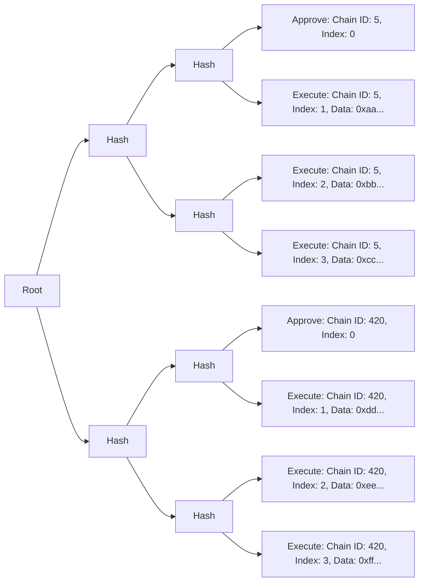

# Sphinx Merkle Tree
Sphinx uses a custom Merkle tree data structure to allow teams to approve arbitrarily large deployments across an arbitrary number of networks via an off-chain signature. Those deployments can then be trustlessly executed via their Gnosis Safe by a third-party relayer using their SphinxModuleProxy. This document outlines the architecture and content of the Sphinx Merkle tree.

**Vocabulary notes**:
- An _executor_ is the specific account that needs to submit the transactions to the `SphinxModuleProxy` to execute a deployment on-chain. In some cases the executor may be a contract which forwards transactions to the `SphinxModuleProxy` from many different EOAs. This is the case with the Sphinx DevOps platform which uses `ManagedService.sol` as it's primary executor.
- A _relayer_ is an off-chain process that is responsible for executing deployments using a Sphinx Merkle tree and signed root. Note that the relayer may be a complex system using multiple EOAs such as is the case with the Sphinx DevOps platform.
- A _Valid Merkle Tree_ is a Sphinx Merkle tree that conforms to the [Merkle Tree Invariants](#high-level-merkle-tree-invariants). Any other Merkle tree that matches the data structure of the Sphinx Merkle tree, but that does not adhere to those invariants, we refer to as invalid even if the tree may still be executable on-chain.
- A leaf _index_ refers to the explicit `index` field on the SphinxLeaf data type. It does _not_ refer to the leafs position within the tree. [^1]

### Relevant Files
- Standard Merkle Tree Generation Logic: [`merkle-tree.ts`](https://github.com/sphinx-labs/sphinx/blob/feature/pre-audit/packages/contracts/src/merkle-tree.ts)
- Unit tests: [`merkle-tree.spec.ts`](https://github.com/sphinx-labs/sphinx/blob/feature/pre-audit/packages/contracts/test/mocha/merkle-tree.spec.ts)

## Table of Contents
- [Merkle Tree Architecture](#merkle-tree-architecture)
- [Merkle Leaf Types](#merkle-leaf-types)
  - [`APPROVE` Leaf Data](#approve-leaf-data)
  - [`EXECUTE` Leaf Data](#execute-leaf-data)
- [Valid Merkle Trees](#valid-merkle-trees)
- [High-Level Merkle Tree Invariants](#high-level-merkle-tree-invariants)
- [Merkle Tree Generation Logic](#merkle-tree-generation-logic)
- [Dependencies](#dependencies)
- [Assumptions](#assumptions)
- [Footnotes](#footnotes)

## Merkle Tree Architecture

Each leaf in the Merkle tree represents a single action on a single chain. There are three types of actions:
- **`APPROVE`**: Approve a new deployment. This must occur before the deployment can be executed.
- **`EXECUTE`**: Execute a transaction in the deployment. A deployment must be approved on a chain before it can be executed.
- **`CANCEL`**: Cancel an active deployment.

A diagram of a typical Merkle tree is shown below (displayed from left to right to reduce horizontal space):

This Merkle tree contains a deployment on two chains. There are three transactions for each deployment.

You'll notice that each Merkle leaf has an index. On any given chain, the Merkle leaves must be executed in ascending order according to their indexes. Note that the Sphinx Merkle tree uses an explicit index rather than relying on the order of the leaves within the tree. This introduces some complicity in the way that Sphinx Merkle trees can be structured which we cover in the [Merkle Tree Invariants](#high-level-merkle-tree-invariants) below.

### Merkle Leaf Types

Each leaf in the Merkle tree contains the following fields:
* `uint256 chainId`: The target chain id
* `uint256 index`: The index of the leaf
* `SphinxLeafType leafType`: The type of the leaf, either `APPROVE` or `EXECUTE`. On-chain, both leaf types are represented as a [`SphinxLeaf`](https://github.com/sphinx-labs/sphinx/blob/feature/pre-audit/packages/contracts/contracts/core/SphinxDataTypes.sol#L17-L30).
* `bytes data`: Arbitrary data that is encoded based on the leaf type. We'll describe the fields of the decoded data for each leaf type below.

### `APPROVE` Leaf Data

The `data` field of an `APPROVE` leaf consists of the following fields, which are ABI encoded:
* `address safeProxy`: The address of the Gnosis Safe.
* `address moduleProxy`: The address of the `SphinxModuleProxy` that is coordinating the deployment.
* `uint256 deploymentNonce`: The nonce of the deployment in the `SphinxModuleProxy`.
* `uint256 numLeaves`: The total number of leaves in the Merkle tree on the current chain. There must be at least one leaf (the `APPROVE` leaf).
* `address executor`: The address that must call the SphinxModuleProxy to execute the deployment. Note that the executor may be a smart contract.
* `string uri`: An optional field that contains the URI of the deployment. Its purpose is to provide a public record that allows anyone to re-assemble the entire deployment from scratch. This may include the Solidity compiler inputs, which are required for Etherscan verification. The format, location, and contents of the URI are determined by off-chain tooling.
* `bool arbitraryChain`: If this is `true`, the Merkle root can be executed on any chain without the explicit permission of the Gnosis Safe owners. This is useful if the owners want their system to be permissionlessly deployed on new chains. By default, this is disabled, which means that the Gnosis Safe owners must explicitly approve the deployment on individual chains.

### `EXECUTE` Leaf Data

The `data` field of an `EXECUTE` leaf primarily contains data to forward to the Gnosis Safe. It consists of the following fields, which are ABI encoded:
* `address to`: The target address of the transaction. This is _not_ the address of the Gnosis Safe.
* `uint256 value`: The amount of native gas token to transfer from the Gnosis Safe to the target address. This value is not transferred from the `SphinxModuleProxy`.
* `uint256 gas`: The amount of gas that's included in the call from the `SphinxModuleProxy` to the Gnosis Safe.
* `bytes txData`: The transaction's data.
* `Enum.Operation operation`: The type of transaction to execute in the Gnosis Safe, i.e. `Call` or `DelegateCall`.
* `bool requireSuccess`: If this is `true` and the transaction in the Gnosis Safe fails, the deployment is marked as "failed" and will end immediately. If this is `false`, the deployment will continue regardless of whether the transaction fails.

### `CANCEL` Leaf Data
TODO

## Valid Merkle Trees
There are a wide variety of trees that conform to the basic structure described above, but not all of them will necessarily be executable on-chain for all networks they contain leaves for. For example, it is possible to include two leaves with the same `index` and `chainId`. In that case, both leaves would be valid but only one would be executable.

To resolve these types of problems we outline a set of Merkle tree invariants below that define what a 'valid' Merkle tree looks like. We expect relayers to rely on Merkle trees following the invariants set out here. We assume that relayers will refuse to execute Merkle trees that do not follow these invariants.

## High-Level Merkle Tree Invariants

### 1. Must be executable on all chains for which there is at least one Merkle leaf.
Assumption: The input Merkle leaf(s) data satisfies the on-chain conditions in the corresponding SphinxModuleProxy contract(s). See the [SphinxModuleProxy specification](https://github.com/sphinx-labs/sphinx/blob/feature/pre-audit/specs/sphinx-module-proxy.md#function-level-invariants) for more information.

### 2. Each leaf on a chain must have an index field with a value that sequentially increments by 1
To ensure that `EXECUTE` leaves are executed in the correct order, all Merkle tree leaves must have an `index` field that starts at 0 on each chain and sequentially increments by 1.

### 3. Every leaf `chainId` and `index` combination must be unique within the tree
Constructing a tree with multiple leaves with the same chain ID and index would make it ambiguous which leaf should be executed, and would result in a tree that cannot be fully executed. So we impose the restriction that in a valid Merkle tree there must be at most one leaf with each chain ID and index combination which ensures there is unambiguous ordering of leaves within the tree.

### 4. There must be exactly one `APPROVE` leaf or `CANCEL` leaf per chain
Constructing a tree that contains `APPROVE` or `CANCEL` leaves that approve or cancel multiple separate deployments on a single chain would lead to an ambiguous situation for the relayer where it is unclear which deployment should be approved or canceled. So we impose the restriction that in a valid Merkle tree there must be exactly one `APPROVE` or `CANCEL` leaf per chain.

If the `arbitraryChain` field is set to true, then we consider this approval leaf to apply to all chains. Therefore if `arbitraryChain` = true, there should be exactly one `APPROVE` leaf in the entire tree and no `CANCEL` leaves.

### 5. Merkle tree leaves must be ordered in the tree by the leaf's `index` and `chainId` fields ascending [^2]
Sphinx Merkle tree leaves use an explicit `index` field in the leaf rather than an implicit index determined by the leaves position in the tree. This is because the Sphinx Merkle tree is intended to be executed across multiple networks and not all leaves will be executed on all networks. We impose the restriction the tree leaves will be ordered by their `index` and `chainId` fields ascending.

So for example, if we intended to run a single transaction on Goerli (5), OP Goerli (420), and Polygon Mumbai (80001). Then the leaves are are expected to be ordered like so:
1. Approval Leaf on Goerli (Chain ID 5)
2. Execute Leaf on Goerli
3. Approval Leaf on OP Goerli (Chain ID 420)
4. Execute Leaf on OP Goerli
5. Approval Leaf on Polyon Mumbai (Chain ID 80001)
6. Execute Leaf on Polygon Mumbai

## Merkle Tree Generation Logic
We provide utility for generating Sphinx Merkle trees. This utility is used by the official Sphinx Foundry plugin. We expect it to generate Merkle trees that adhere to the above invariants.

### `const makeSphinxMerkleTree = (deploymentData: DeploymentData): SphinxMerkleTree`

#### Input
Accepts a [DeploymentData](https://github.com/sphinx-labs/sphinx/blob/591ff8a33578ecf61f184f4afc83a551397009f9/packages/contracts/src/merkle-tree.ts#L45C23-L45C23) object where the keys are canonical chain ids and the values are deployment data objects which contain all of the necessary info to assemble a SphinxMerkleTree. The Sphinx Merkle tree generation function should be agnostic to the source of the transaction data so it can be used to assemble a tree based on transactions generated from any scripting framework (i.e Foundry, Hardhat Ignition, some arbitrary future framework).

#### Output
Outputs a [SphinxMerkleTree](https://github.com/sphinx-labs/sphinx/blob/591ff8a33578ecf61f184f4afc83a551397009f9/packages/contracts/src/merkle-tree.ts#L115) object that follows the above specification and invariants.

## Dependencies
The Merkle tree generation logic makes calls to two battle-tested external libraries. We use `ethers` version 6.7.0 to handle ABI encoding tree leaf `data`, and we use `@openzeppelin/merkle-tree` version 1.0.5 to assemble the Merkle tree. We test that interactions with these libraries work properly in our [SphinxModuleProxy unit tests](https://github.com/sphinx-labs/sphinx/blob/feature/pre-audit/packages/contracts/test/SphinxModuleProxy.t.sol) which cover that Merkle trees generated by this logic have data that is encoded properly and that they are executable on-chain. However, we do not test the internals of these libraries and instead rely on the assumption that they are robust and bug-free.

## Assumptions
The Merkle tree generation logic outputs trees which are valid and executable. However, there is no foolproof requirement that it be used. We make the asumption that relayers like the Sphinx DevOps platform will refuse to execute Merkle trees that are not valid according to the invariants defined in this document.

Merkle trees generated with this logic are only valid to the extent that the data used to generate them is valid. We make the assumption that the input data satisfies the [on-chain conditions in the corresponding SphinxModuleProxy contract(s)](https://github.com/sphinx-labs/sphinx/blob/feature/pre-audit/specs/sphinx-module-proxy.md#function-level-invariants).

## Footnotes
[^1]: Because the Sphinx Merkle tree contains leaves that are intended to be executed across multiple networks and not all leaves will be executed on all networks, we cannot rely on the position of the leaves within the tree to determine the leaf index. Instead, we use an explicit `index` field on each leaf.
[^2]: Because Sphinx Merkle tree leaves contain explicit `index` fields, it is technically possible to assemble Merkle trees that have leaves which are ordered in a variety of ways (such as reverse order or simply random). We impose the ordering restriction to help make it easier to understand the content of the Merkle tree. It also benefits offchain relayer infrastructure.
