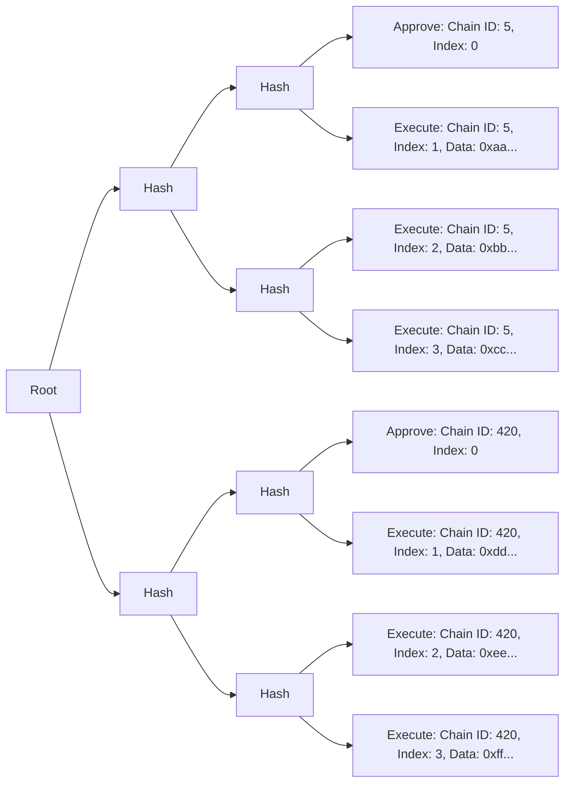

# Sphinx Merkle Tree
Sphinx uses a custom Merkle tree data structure to allow teams to approve arbitrarily large deployments across an arbitrary number of networks via an off-chain signature. Those deployments can then be trustlessly executed via their Gnosis Safe by a third-party executor using their `SphinxModuleProxy`. This document outlines the architecture and content of the Sphinx Merkle tree.

**Vocabulary notes**:
- An _executor_ is the third-party system responsible for executing deployments using a Sphinx Merkle tree and signed root.
- A _valid Merkle tree_ is a Sphinx Merkle tree that conforms to the [Merkle Tree Invariants](#high-level-merkle-tree-invariants).
- A leaf _index_ refers to the explicit `index` field on the `SphinxLeaf` data type. It does _not_ refer to the leaf's position within the tree. [^1]

### Relevant Files
- Merkle Tree Generation Logic: [`merkle-tree.ts`](https://github.com/sphinx-labs/sphinx/blob/develop/packages/contracts/src/merkle-tree.ts)
- Unit tests: [`merkle-tree.spec.ts`](https://github.com/sphinx-labs/sphinx/blob/develop/packages/contracts/test/mocha/merkle-tree.spec.ts)

## Table of Contents
- [Merkle Tree Architecture](#merkle-tree-architecture)
- [Merkle Leaf Types](#merkle-leaf-types)
  - [`APPROVE` Leaf Data](#approve-leaf-data)
  - [`EXECUTE` Leaf Data](#execute-leaf-data)
  - [`CANCEL` Leaf Data](#cancel-leaf-data)
- [High-Level Merkle Tree Invariants](#high-level-merkle-tree-invariants)
- [Merkle Tree Generation Logic](#merkle-tree-generation-logic)
- [Dependencies](#dependencies)
- [Assumptions](#assumptions)
  - [Executor Behavior Regarding Invalid Merkle Trees](#executor-behavior-regarding-invalid-merkle-trees)
  - [Input Data](#input-data)
- [Footnotes](#footnotes)

## Merkle Tree Architecture

Each leaf in the Merkle tree represents a single action on a single chain. There are three types of actions:
- **`APPROVE`**: Approve a new deployment. This must occur before the deployment can be executed.
- **`EXECUTE`**: Execute a transaction in the deployment.
- **`CANCEL`**: Cancel an active deployment.

A diagram of a typical Merkle tree is shown below (displayed from left to right to reduce horizontal space):

This Merkle tree contains a deployment on two chains. There are three transactions for each deployment.

You'll notice that each Merkle leaf has an `index`. The Merkle leaves must be executed in ascending order according to their indexes on any given chain. Note that the Sphinx Merkle tree uses an explicit `index` field rather than relying on the position of the leaves within the tree.

### Merkle Leaf Types

On-chain, all leaf types are represented as a [`SphinxLeaf`](https://github.com/sphinx-labs/sphinx/blob/develop/packages/contracts/contracts/core/SphinxDataTypes.sol#L28). Each leaf in the Merkle tree contains the following fields:
* `uint256 chainId`: The target chain id.
* `uint256 index`: The index of the leaf.
* `SphinxLeafType leafType`: The type of the leaf, either `APPROVE`, `EXECUTE`, or `CANCEL`.
* `bytes data`: Arbitrary data encoded based on the leaf type. We'll describe the fields of the decoded data for each leaf type below.

### `APPROVE` Leaf Data

The `data` field of an `APPROVE` leaf consists of the following fields, which are ABI encoded:
* `address safeProxy`: The address of the Gnosis Safe.
* `address moduleProxy`: The address of the `SphinxModuleProxy` coordinating the deployment.
* `uint256 merkleRootNonce`: The nonce of the Merkle root in the `SphinxModuleProxy`.
* `uint256 numLeaves`: The total number of leaves in the Merkle tree on the current chain. There must be at least one leaf (the `APPROVE` leaf).
* `address executor`: The address that must call the `SphinxModuleProxy` to execute the deployment. Note that the executor may be a smart contract.
* `string uri`: An optional field that contains the URI of the Merkle tree metadata. Its purpose is to provide a public record that allows anyone to re-assemble the entire tree from scratch. This data may include the Solidity compiler inputs required for Etherscan verification. Off-chain tooling determines the format, location, and contents of the URI.
* `bool arbitraryChain`: If this is `true`, then anyone can execute the Merkle tree on any chain without the explicit permission of the Gnosis Safe owners as long as their signatures are available. This is useful if the owners want their system to be permissionlessly deployable on new chains. By default, this is disabled, which means that the Gnosis Safe owners must explicitly approve the deployment on individual chains.

### `EXECUTE` Leaf Data

An `EXECUTE` leaf's `data` field primarily contains data to forward to the Gnosis Safe. It consists of the following fields, which are ABI encoded:
* `address to`: The target address of the transaction. _Not_ the address of the Gnosis Safe.
* `uint256 value`: The amount of native gas token to transfer from the Gnosis Safe to the target address. This value is not transferred from the `SphinxModuleProxy`.
* `uint256 gas`: The amount of gas to include in the call from the `SphinxModuleProxy` to the Gnosis Safe.
* `bytes txData`: The transaction's data.
* `Enum.Operation operation`: The type of transaction to execute in the Gnosis Safe, i.e. `Call` or `DelegateCall`.
* `bool requireSuccess`: If this is `true` and the transaction in the Gnosis Safe fails, the deployment is marked as "failed" and will end immediately. If this is `false`, the deployment will continue regardless of whether the transaction fails. [^2]

### `CANCEL` Leaf Data

The `data` field of an `CANCEL` leaf consists of the following fields, which are ABI encoded:
* `address safeProxy`: See [`APPROVE` leaf data](#approve-leaf-data).
* `address moduleProxy`: See [`APPROVE` leaf data](#approve-leaf-data).
* `uint256 merkleRootNonce`: See [`APPROVE` leaf data](#approve-leaf-data).
* `bytes32 merkleRootToCancel`: The Merkle root of the deployment that should be canceled.
* `address executor`: See [`APPROVE` leaf data](#approve-leaf-data).
* `string uri`: See [`APPROVE` leaf data](#approve-leaf-data).

## High-Level Merkle Tree Invariants
These invariants aim to define an unambiguous, consistent structure for Sphinx Merkle trees. This ensures that it's easy for off-chain tooling to recreate the exact Merkle tree signed by the user and to check that a given Merkle tree is valid. It's worth mentioning that it's possible to construct Merkle trees that do not adhere to this spec but are executable on-chain. We discuss this possibility and the expected executor behavior in more detail in the [Assumptions section](#assumptions).

### 1. Must be executable on all chains for which there is at least one Merkle leaf.
We assume that the input Merkle leaf data satisfies the on-chain conditions in the corresponding `SphinxModuleProxy` contract and that the executor is not buggy. See the [Assumptions section](#assumptions) for more information.

Notice this invariant is not tested in [`merkle-tree.spec.ts`](https://github.com/sphinx-labs/sphinx/blob/develop/packages/contracts/test/mocha/merkle-tree.spec.ts). Instead, we test this invariant by using our Merkle tree generation logic for the [main `SphinxModuleProxy` tests](https://github.com/sphinx-labs/sphinx/blob/develop/packages/contracts/test/SphinxModuleProxy.t.sol). These tests cover a wide variety of single and multichain cases.

### 2. If `arbitraryChain` is false in every `APPROVE` leaf, then there must be exactly one `APPROVE` leaf or `CANCEL` leaf per `chainId`
Constructing a tree that contains `APPROVE` or `CANCEL` leaves that approve or cancel multiple separate deployments on a single chain would lead to an ambiguous situation for the executor. It would be unclear which leaf should be approved or canceled. So we impose the restriction that in a valid Merkle tree, there must be exactly one `APPROVE` or `CANCEL` leaf per chain.

### 3. If `arbitraryChain` is true in *any* `APPROVE` leaf, then there must be exactly one `APPROVE` leaf in the entire tree, and no `CANCEL` leaves
If the `arbitraryChain` field is set to true in an `APPROVE` leaf, then we consider this leaf to apply to all chains. Therefore, if `arbitraryChain` is set to true, there must be exactly one `APPROVE` leaf in the entire tree and no `CANCEL` leaves to ensure there is no ambiguity in precisely which leaf should be executed.

### 4. `EXECUTE` leaves must always follow an `APPROVE` leaf with the same `chainId`
All `EXECUTE` leaves must follow an `APPROVE` leaf on the same chain, verifying that the owners of the `SphinxModuleProxy` have approved them.

### 5. `EXECUTE` leaves must *never* exist in a tree with a `CANCEL` leaf with the same `chainId`
To ensure that all `EXECUTE` leaves are executable, they must *never* follow a `CANCEL` leaf on the same chain. The presence of a `CANCEL` leaf for a given chain [implies there is no `APPROVE` leaf](#2-if-arbitrarychain-is-false-in-every-approve-leaf-then-there-must-be-exactly-one-approve-leaf-or-cancel-leaf-per-chain), and therefore any `EXECUTE` leaves on that chain [will not be executable](#4-execute-leaves-must-always-follow-an-approve-leaf-on-the-same-chain-according-to-their-index-field).

### 6. Every leaf `chainId` and `index` combination must be unique within the tree
Constructing a tree with multiple leaves with the same `chainId` and `index` would make it ambiguous which leaf should be executed, resulting in a tree that cannot be fully executed. So, we impose the restriction that there must be at most one leaf with each `chainId` and `index` combination in a valid Merkle tree. This restriction ensures there is an unambiguous ordering of leaves within the tree.

### 7. Each APPROVE or CANCEL leaf must have an index of `0`
To ensure that `APPROVE` and `CANCEL` leaves always happen first on a given chain, their `index` must always be `0`.

### 8. Each sequence of EXECUTE leaves with the same `chainId` must have the index of the first leaf be `1` and the index of the following leaves sequentially increment by `1`
To ensure that all the `EXECUTE` leaves are executed in the correct order, they must have an `index` field that starts at `1` on each chain and sequentially increments by `1`.

### 9. Merkle tree leaves must be ordered in the tree by the leaf's hash descending
We enforce that each leaf in a Sphinx Merkle tree must be ordered by the leaf's hash descending. This ordering ensures the Merkle tree can be reproduced reliably by off-chain tooling.

The leaf's hash is defined as the ABI encoded [`SphinxLeaf`](https://github.com/sphinx-labs/sphinx/blob/develop/packages/contracts/contracts/core/SphinxDataTypes.sol#L28) double-hashed using `keccak256`. For reference, the hash of the `SphinxLeaf` is [calculated by the `SphinxModule` in the `_getLeafHash` function](https://github.com/sphinx-labs/sphinx/blob/develop/packages/contracts/contracts/core/SphinxModule.sol#L414).

Note that for the Sphinx Merkle tree generation logic we assume the `@openzeppelin/merkle-tree` dependency properly hashes and sorts the tree leaves. See the [Dependencies](#dependencies) for more details.

## Merkle Tree Generation Logic
We provide a utility for generating Sphinx Merkle trees used by the official Sphinx Foundry plugin. We expect it to generate Merkle trees that adhere to the above invariants.

#### `const makeSphinxMerkleTree = (deploymentData: DeploymentData): SphinxMerkleTree`

#### Input
Accepts a [DeploymentData](https://github.com/sphinx-labs/sphinx/blob/develop/packages/contracts/src/merkle-tree.ts#L45) object where the keys are canonical chain ids, and the values are deployment data objects which contain all of the necessary info to assemble a `SphinxMerkleTree`. The Merkle tree generation function should be agnostic to the transaction data source so anyone can generate a tree based on transactions from any scripting framework (i.e. Foundry, Hardhat Ignition, some arbitrary future framework).

#### Output
Outputs a [SphinxMerkleTree](https://github.com/sphinx-labs/sphinx/blob/develop/packages/contracts/src/merkle-tree.ts#L128) object that follows the above [architecture](#merkle-tree-architecture) and [invariants](#high-level-merkle-tree-invariants).

## Dependencies
The Merkle tree generation utility makes calls to external libraries. We use [`ethers` version 6.7.0](https://github.com/ethers-io/ethers.js/releases/tag/v6.7.0) to handle ABI encoding tree leaf `data` and [`@openzeppelin/merkle-tree` version 1.0.5](https://github.com/OpenZeppelin/merkle-tree/releases/tag/v1.0.5) to assemble the Merkle tree. We test that interactions with these libraries work correctly in our [SphinxModuleProxy tests](https://github.com/sphinx-labs/sphinx/blob/develop/packages/contracts/test/SphinxModuleProxy.t.sol) which test that Merkle trees generated by this logic have data that is encoded correctly and that they are executable on-chain. However, we do not test the internals of these libraries and instead rely on the assumption that they are robust and bug-free.

Specifically, the Sphinx Merkle tree generation logic relies on the `@openzeppelin/merkle-tree` dependency to [sort](https://github.com/OpenZeppelin/merkle-tree/blob/7734be7008d0669d73a5e09c0823b32290409e3d/src/standard.ts#L39-L43) the tree leaves in descending order by their [hash](https://github.com/OpenZeppelin/merkle-tree/blob/7734be7008d0669d73a5e09c0823b32290409e3d/src/standard.ts#L9). This is required to satisfy [invariant 9](#9-merkle-tree-leaves-must-be-ordered-in-the-tree-by-the-leafs-hash-descending). We assume that their hashing and sorting logic is robust and bug-free.

## Assumptions

### Executor Behavior Regarding Invalid Merkle Trees
The Merkle tree generation utility provided here is used by the official Sphinx Foundry plugin. However, there is no hard requirement that it be used to generate all Merkle trees. Some third-party could implement their own plugin and with some alternative generation logic.

It is possible to use alternative generation logic to construct Merkle trees that fit the high-level [architecture](#merkle-tree-architecture) of the Sphinx Merkle tree and are executable on-chain but that are invalid according to the invariants defined above. For example, one could construct a Merkle tree with a different method of determining the position of leaves within the tree (such as reverse or random order), but that still have valid `index` and `chainId` fields for every leaf. It would be possible to execute a tree like this as long as the leaves are submitted in the correct order according to their `index` field. However, this tree would not be valid according to [invariant 9](#9-merkle-tree-leaves-must-be-ordered-in-the-tree-by-the-leafs-index-and-chainid-fields-ascending).

Likewise, it is possible to use alternative generation logic to construct Merkle trees that fit the high-level [architecture](#merkle-tree-architecture) of the Sphinx Merkle tree but that are invalid according to the [invariants](#high-level-merkle-tree-invariants) and are not executable on-chain. For example, one could create a tree that contains multiple leaves with the same `index` and `chainId` fields. In this case, it would only be possible to execute one of these leaves. As a result, it would only be possible to execute this Merkle tree partially. Furthermore, precisely which leaf should be executed if one attempted to execute the tree would be ambiguous.

We assume that executors like the Sphinx DevOps Platform will use the invariants defined in this document to determine whether or not a given Merkle tree is valid. Furthermore, we assume they will refuse to execute Merkle trees that are not valid according to the invariants defined in this document, even if it may theoretically be possible to partially or fully execute the Merkle tree.

### Input Data
Merkle trees generated with this logic are only valid to the extent that the data used to create them is accurate. We assume that the input data is correct with respect to the current state of the `SphinxModuleProxy` on any given network. I.e. we assume that the input `safeProxy` and `moduleProxy` addresses are valid, that the `nonce` is correct, etc. Furthermore, we assume that the input transaction data itself is valid.

### Bug-Free Executors
The Merkle trees generated with this logic are executable to the extent that the process used to execute them is bug-free. For example, a buggy executor could take a valid Merkle tree leaf and attempt to execute it on the incorrect chain or against the incorrect `SphinxModuleProxy`. This would result in the transaction reverting. So, for this document, we assume that the executor is bug-free. For more information on buggy executors, see the [Assumptions section of the SphinxModuleProxy specification](https://github.com/sphinx-labs/sphinx/blob/develop/specs/sphinx-module-proxy.md#assumptions).

## Footnotes
[^1]: Because the Sphinx Merkle tree contains leaves intended to be executed across multiple networks and not all leaves will be executed on all networks, we cannot rely on the position of the leaves within the tree to determine the leaf index. Instead, we use an explicit `index` field on each leaf.
[^2]: The default value for `requireSuccess` is `true` in the Sphinx Foundry plugin. We recommend using `true` in most cases since it's safest to immediately halt a deployment if one of the transactions fails. However, there are some legitimate situations where you would want to use `false`. For example, if you were deploying using a permissionless CREATE2 factory like [Arachnid's deterministic deployment proxy](https://github.com/Arachnid/deterministic-deployment-proxy). If somebody deploys your contract ahead of time using that proxy, they could cause your deployment to fail since the transaction attempting to deploy the contract again would fail. In this case, it is perfectly reasonable to ignore the failure.
