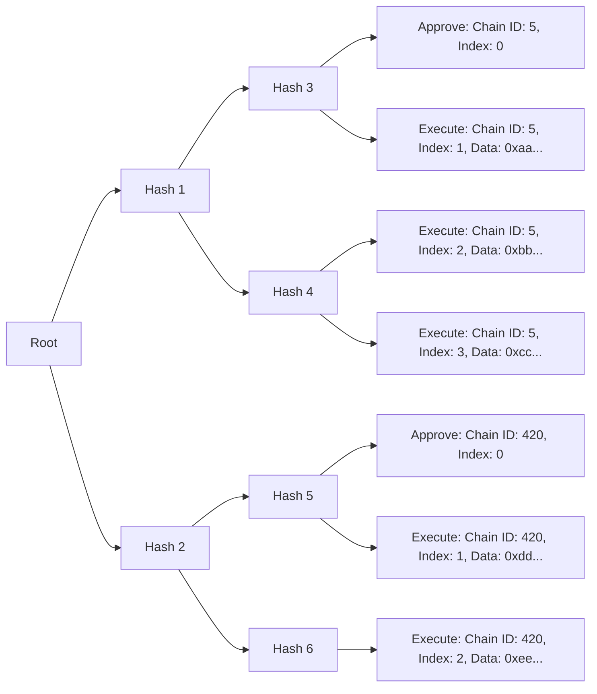

# `SphinxModuleProxy` Contract Specification

TODO: explain why SphinxModuleProxy

TODO: explain key data structures, e.g. whichever data structure has the numLeafs field

The Merkle root is analogous to a Git commit hash in the sense that it encompasses a large amount of data into a single hash. Instead of

TODO: the URI can be an empty string

TODO: displayed from left to right to reduce the horizontal length of the tree


    // ```mermaid
    // graph TD
    //     style C fill:#ffff99,stroke:#cccc00,stroke-width:2px
    //     style B fill:#99ff99,stroke:#00cc00,stroke-width:2px
    //     style F fill:#ff9999,stroke:#cc0000,stroke-width:2px
    //     style I fill:#99ccff,stroke:#0066cc,stroke-width:2px
    //     Z["approve(...)"] --> H[Is there an existing deployment?]
    //     H -->|Yes| I[Cancel existing deployment]
    //     H -->|No| A[Is there one leaf in the new merkle tree for the current chain?]
    //     I -->A
    //     A -->|Yes| B[Completed]
    //     A -->|No| C[Approved]
    //     C --> D["execute(...)"]
    //     D --> E[Did the Safe txn fail and does the leaf specify that it must succeed?]
    //     E -->|Yes| F[Failed]
    //     E -->|No| G[Are there any more leafs to execute for the current chain in this
    // deployment?]
    //     G -->|Yes| D
    //     G -->|No| B
    // ```


## High-Level Invariants

- There can only be one active Merkle root in a `SphinxModuleProxy` at a time.
- A Merkle root must contain at most one deployment per chain.
- Each leaf in a Merkle tree must be submitted exactly once.
- The leafs in a Merkle tree must be submitted in ascending order on each chain according to the leaf's index.
- The Gnosis Safe owners must be able to cancel an active Merkle root in the `SphinxModuleProxy`.
- The Gnosis Safe owners must be able to cancel a Merkle root that has been signed off-chain, but is not yet active in the `SphinxModuleProxy`. (TODO(somewhere): explain how this is possible)
- The Merkle proof verification logic must hash the Merkle leaf using the internal [`_getLeafHash` function](TODO(end)).
- All of the behavior described in this specification must apply to [all Gnosis Safe contracts supported by Sphinx](TODO(end)).

## Function-Level Invariants

#### `function initialize(address _safeProxy) external`

- Must revert this function has already been called.
- Must revert if the input Gnosis Safe proxy is the zero address.
- A successful call must set the Gnosis Safe proxy in the `SphinxModuleProxy`.

#### `function approve(bytes32 _root, SphinxLeafWithProof memory _leafWithProof, bytes memory _signatures) public`

- Must revert if the `SphinxModuleProxy` calls this function, either directly or indirectly (i.e. re-entrancy is not allowed).
- Must revert if the input Merkle root is `bytes32(0)`.
- Must revert if the Merkle root has ever been approved before.
- Must revert if the input Merkle leaf does not yield the input Merkle root, given the input Merkle proof.
- Must revert if the Merkle leaf's type does not equal `APPROVE`.
- Must revert if the Merkle leaf's index does not equal `0`.
- The following conditions apply to the ABI decoded Merkle leaf data:
  - Must revert if the leaf data contains a Gnosis Safe address that does not equal the Gnosis Safe address in the `SphinxModuleProxy`.
  - Must revert if the leaf data contains a `SphinxModuleProxy` address that does not equal the current contract's address (i.e. `address(this)`).
  - Must revert if the leaf data contains a nonce that does not equal the current nonce in the `SphinxModuleProxy`.
  - Must revert if the leaf data contains a `numLeafs` field that equals `0`.
  - Must revert if the leaf data contains an `executor` field that does not equal the caller's address.
  - Must revert if the Merkle root cannot be [executed on an arbitrary chain](TODO) _and_ the leaf data contains a `chainId` field that does not match the current chain ID.
- Must revert if an insufficient number of Gnosis Safe owners have signed the EIP-712 data that contains the input Merkle root.
- A successful call must:
  - Emit a `SphinxDeploymentApproved` event in the `SphinxModuleProxy`.
  - Set all of the fields in the [`DeploymentState` struct](TODO(end)).
  - Increment the nonce in the `SphinxModuleProxy`.
- If there is an existing active Merkle root in the `SphinxModuleProxy`, a successful call must also:
  - Set the `DeploymentStatus` of the _existing_ Merkle root to `CANCELLED`.
  - Emit a `SphinxDeploymentCancelled` event in the `SphinxModuleProxy` using the _existing_ Merkle root.
- If there is a single leaf in the Merkle tree for the current chain, a successful call must also:
  - Set the `DeploymentStatus` of the input Merkle root to be `COMPLETED`.
  - Remove the active Merkle root, preventing it from being approved in the future.
  - Emit a `SphinxDeploymentCompleted` event in the `SphinxModuleProxy` using the input Merkle root.
- If there is more than one leaf in the Merkle tree for the current chain, a successful call must also:
  - Set the `DeploymentStatus` of the input Merkle root to be `APPROVED`.
  - Set the active Merkle root equal to the input Merkle root.

#### `function execute(SphinxLeafWithProof[] memory _leafsWithProofs) public returns (DeploymentStatus)`

- Must revert if the `SphinxModuleProxy` calls this function, either directly or indirectly (i.e. re-entrancy is not allowed).
- Must revert if the input `_leafsWithProofs` array does not contain any elements.
- Must revert if there is no active Merkle root.
- Must revert if the caller is not the executor specified in the `approve` function.
- Must revert if the number of leafs executed for the current Merkle root is greater than the `numLeafs` specified in the `approve` function.
- For each element of the `_leafsWithProofs` array:
  - Must revert if the current Merkle leaf does not yield the active Merkle root, given the current Merkle proof.
  - Must revert if the current Merkle leaf's type does not equal `EXECUTE`.
  - Must revert if the Merkle root cannot be [executed on an arbitrary chain](TODO) _and_ the leaf data contains a `chainId` field that does not match the current chain ID.
  - Must revert if the current Merkle leaf is executed in the incorrect order (i.e. its index isn't correct).
  - Must revert if the transaction has an [insufficient amount of gas](TODO).
  - A successful iteration must:
    - Increment the number of leafs executed for the active Merkle root by `1`.
    - Attempt to execute a transaction in the user's Gnosis Safe using the data in the current Merkle leaf.
    - The call to the user's Gnosis Safe must never revert[TODO(^A)].
      - Rationale: This would cause the user's deployment to be active indefinitely until they manually cancel it.
    - If the call to the Gnosis Safe is successful:
      - Must emit a `SphinxActionSucceeded` event in the `SphinxModuleProxy`.
    - If the call to the Gnosis Safe is unsuccessful for any reason:
      - Must emit a `SphinxActionFailed` event in the `SphinxModuleProxy`.
    - If the call to the Gnosis Safe is unsuccessful for any reason _and_ the current leaf requires a success:
      - Must emit a `SphinxDeploymentFailed` event in the `SphinxModuleProxy`.
      - Must set the active Merkle root's `DeploymentStatus` equal to `FAILED`.
      - Must remove the active Merkle root, preventing it from being approved in the future.
      - Must exit the `execute` function immediately, returning a `DeploymentStatus` equal to `FAILED`.
- If there are no more leafs to execute for the active Merkle root:
  - Must set the active Merkle root's `DeploymentStatus` equal to `COMPLETED`.
  - Must emit a `SphinxDeploymentCompleted` event in the `SphinxModuleProxy` using the active Merkle root.
  - Must remove the active Merkle root, preventing it from being approved in the future.
  - Must return a `DeploymentStatus` equal to `COMPLETED`.
- If there are more leafs to execute for the active Merkle root:
  - Must return a `DeploymentStatus` equal to `APPROVED`.

#### `function _getLeafHash(SphinxLeaf memory _leaf) internal pure returns (bytes32)`

- Must double-hash the ABI-encoded Merkle leaf.
  - Rationale: We double-hash to prevent second preimage attacks, as recommended by [OpenZeppelin's Merkle Tree library](https://github.com/OpenZeppelin/merkle-tree#standard-merkle-trees).


// TODO(assumption): the executor cannot lose money on a deployment. We can assume this because
// we have off-chain billing logic that ensures we're reimbursed for all deployment costs.


// TODO(assumption): actors:
// - buggy executor (finished): the first two bullet points of 'malicious executor'
// - malicious executor:
//      - wait an arbitrary amount of time to approve then execute a deployment.
//      - partially execute a deployment.
//      - users can cancel deployments, but it's possible for the executor to approve a deployment
//        once the user has signaled intent to cancel the deployment. i.e. the executor can watch
//        for the 'cancel' transaction in the mempool, and submit the 'approve' transaction before
//        it.
//      - if a deployment relies on the state of an existing smart contract, and if the executor is
//        able to manipulate the state of that smart contract, then it could be possible for the
//        executor to execute the deployment in a manner that is detrimental to the user. a simple
//        example: a deployment relies on `existingContract.myBoolean() == true`, otherwise it
//        fails. if the executor is able to set `existingContract.myBoolean() == false`, then the
//        deployment will fail.
//      - the executor can interact with a contract in the same transaction that it's deployed,
//        which can be an "unfair advantage" for the executor. for example, if a deployed contract
//        has an open token airdrop, the executor can deploy the contract then claim the airdropped
//        tokens in the same transaction, before any other account has a chance to claim them.

    // TODO(assumption):
    // - (is this true?) a malicious Safe could grief the executor by causing execution to revert.
    //   they could do this by doing `address(0).call{ gas: 10000000000}()` one of the transactions
    //   being executed. this is fine; the user will be billed for all of the executor's gas costs.
    //   another way that the user can grief the executor is by returning a large amount of data in
    //   a "return bomb" attack. this is also fine for the same reason. in the situation that the
    //   gas amount is so high that the transaction cannot be executed at all, the deployment will
    //   remain active until the user cancels it.


            // TODO(somewhere): we use traces to recover any error messages that occur

## Footnotes


^A: Technically, it's possible for the call to the user's Gnosis Safe to revert if the user supplies a `gas` amount that is extremely high (e.g. above the block gas limit). However, we assume that the off-chain logic will detect this before the executor attempts to execute a Merkle leaf like this. (TODO(assumption): add this last sentence as an assumption, then link to it in this footnote).
