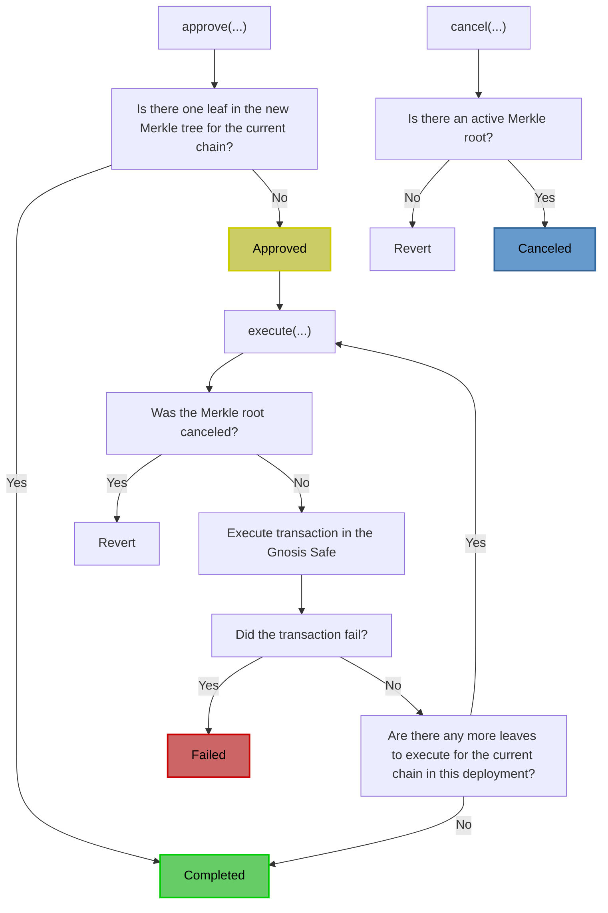

# `SphinxModuleProxy` Contract Specification

> This document assumes that you have read the [Sphinx Merkle Tree specification](https://github.com/sphinx-labs/sphinx/blob/develop/specs/merkle-tree.md). Please read it before continuing.

The `SphinxModuleProxy` submits transactions in a Gnosis Safe and verifies that the Gnosis Safe owners have approved the transactions. Each `SphinxModuleProxy` belongs to a single Gnosis Safe.

A `SphinxModuleProxy` is a minimal, non-upgradeable
[EIP-1167](https://eips.ethereum.org/EIPS/eip-1167) proxy that delegates calls to a `SphinxModule`
implementation contract. In production, users will interact with a `SphinxModuleProxy` instead of
the `SphinxModule` implementation contract, which is why this specification describes the expected
behavior of the proxy. The implementation contract will be locked so nobody can deploy directly
through it.

**Vocabulary notes**:
* An _executor_ is an address with sole permission to execute a deployment in a Gnosis Safe. Normally, deployments will be executed by Sphinx's backend, but the Gnosis Safe owners can specify any executor they'd like.
* A _user_ is a set of Gnosis Safe owners. We use these terms interchangeably throughout this document.

## Table of Contents

- [Relevant Files](#relevant-files)
- [Overview](#overview)
- [Deployment Process](#deployment-process)
- [High-Level Invariants](#high-level-invariants)
- [Function-Level Invariants](#function-level-invariants)
- [Assumptions](#assumptions)
  - [Buggy Executor](#buggy-executor)
  - [Malicious Executor](#malicious-executor)
  - [Malicious Gnosis Safe owner(s)](#malicious-gnosis-safe-owners)
  - [Dependencies](#dependencies)
  - [Malicious Gnosis Safe Singleton](#malicious-gnosis-safe-singleton)
- [Footnotes](#footnotes)

## Relevant Files

- The interface: [`ISphinxModule.sol`](https://github.com/sphinx-labs/sphinx/blob/develop/packages/contracts/contracts/core/interfaces/ISphinxModule.sol)
- The implementation contract: [`SphinxModule.sol`](https://github.com/sphinx-labs/sphinx/blob/develop/packages/contracts/contracts/core/SphinxModule.sol)
- Unit tests: [`SphinxModuleProxy.t.sol`](https://github.com/sphinx-labs/sphinx/blob/develop/packages/contracts/test/SphinxModuleProxy.t.sol)
- Key data structures: [`SphinxDataTypes.sol`](https://github.com/sphinx-labs/sphinx/blob/develop/packages/contracts/contracts/core/SphinxDataTypes.sol)

_Note_: There is no source file for the `SphinxModuleProxy` because we use OpenZeppelin's [`Clones.sol`](https://github.com/OpenZeppelin/openzeppelin-contracts/blob/v4.9.3/contracts/proxy/Clones.sol) for deploying EIP-1167 proxies.

## Overview

Here are the steps of a standard deployment:

1. The Gnosis Safe owners sign a Merkle root off-chain with a meta transaction.
2. The executor initiates the deployment by calling the `approve` function on the Gnosis Safe's `SphinxModuleProxy`. This verifies that a sufficient number of Gnosis Safe owners have signed the Merkle root, then sets the Merkle root as "active".
3. The executor submits the user's transactions by calling the `execute` function on the Gnosis Safe's `SphinxModuleProxy`, which forwards the calls to the Gnosis Safe. This step may involve multiple transactions for larger deployments.

Since a Merkle root can contain deployments across an arbitrary number of chains, this process will occur on every chain the owners approved in the first step.

**It's impossible for the executor to submit anything that the Gnosis Safe owners have not explicitly approved.**

## Deployment Process

There can only be one active Merkle root in a `SphinxModuleProxy` contract at a time. A Merkle root will always exist in one of the five following states:

1. **Empty**: The Merkle root has not been used in the `SphinxModuleProxy` before.
2. **Approved**: The Merkle root has been signed by the Gnosis Safe owners, and the `approve` function has been called on the `SphinxModuleProxy`. This Merkle root is now "active".
3. **Canceled**: A Merkle root that was previously active but has been canceled by the Gnosis Safe owners. Canceled Merkle roots can never be re-approved or executed.
4. **Failed**: A Merkle root will fail if one of the transactions reverts in the Gnosis Safe _and_ the transaction must succeed (i.e. `requireSuccess == true`). Failed Merkle roots can never be re-approved or executed.
5. **Completed**: A Merkle root is considered complete after all the Merkle leaves have been executed on the target chain. Completed Merkle roots can never be re-approved or executed.

We've included a flow chart that highlights the deployment process:

In this flow chart, you'll notice that it's possible to approve a Merkle root that contains a single leaf, in which case the Merkle root is marked as `COMPLETED` immediately. This allows the Gnosis Safe owners to cancel a Merkle root that has been signed off-chain but is not yet active in the `SphinxModuleProxy`.[^1]

## High-Level Invariants

- Each `SphinxModuleProxy` must only be able to execute transactions on one Gnosis Safe.
  - Rationale: This ensures that a `SphinxModuleProxy` will not execute a deployment in one Gnosis Safe when it was actually meant for another Gnosis Safe.
- There must be at most one active Merkle root in a `SphinxModuleProxy` at a time.
  - Rationale: This reduces complexity in the `SphinxModuleProxy`. We don't expect that Gnosis Safe owners will need to execute multiple deployments in parallel.
- Each leaf in a Merkle tree must be submitted exactly once on its target chain in order for the Merkle root to be considered "complete" on that chain.
  - Rationale: Allowing a transaction to be executed multiple times or skipping a transaction can create a security risk for the user's deployment.
- The leaves in a Merkle tree must be submitted in ascending order on each chain according to the leaf's index.
  - Rationale: Transactions in a deployment often need to follow a specific order, such as deploying a contract before initializing it. Reversing this sequence can result in security vulnerabilities.
- On a given network, a Merkle root can either contain a single `CANCEL` leaf _or_ a single `APPROVE` leaf optionally followed by `EXECUTE` leaves.
  - Rationale:
    - While a user might reasonably wish to cancel an old deployment and approve a new one using a single Merkle root, keeping these operations separate reduces complexity in the `SphinxModule`.
    - An `APPROVE` leaf is _optionally_ followed by `EXECUTE` leaves because users may omit the `EXECUTE` leaves if they are canceling a Merkle root that has been signed off-chain, but is not yet active in the `SphinxModuleProxy`.[^1]
- The Gnosis Safe owners must be able to cancel a Merkle root that has been signed off-chain, but is not yet active in the `SphinxModuleProxy`.[^1]
- The Merkle proof verification logic must hash the Merkle leaf using the internal [`_getLeafHash` function](#function-_getleafhashsphinxleaf-memory-_leaf-internal-pure-returns-bytes32).
  - Rationale: This function double hashes the Merkle leaf to prevent second preimage attacks.
- It must be impossible to reuse a signed Merkle root in a different `SphinxModuleProxy`.[^2]
  - Rationale: If a Gnosis Safe enables a new `SphinxModuleProxy` after executing deployments with a different `SphinxModuleProxy`, it must be impossible to re-execute all previous deployments through the newly enabled `SphinxModuleProxy`, since this would be a security hazard.
- It must be impossible to reuse a signed Merkle root in a different Gnosis Safe.[^3]
  - Rationale: If a set of owners sign a Merkle root using a meta transaction, the signature will be valid in all Gnosis Safe contracts that they own. It would be a security hazard if a Merkle root intended for one Gnosis Safe is executed in a different Gnosis Safe.
- It must be impossible to initialize the `SphinxModule` implementation contract directly (i.e., it must only be initializable through a proxy).
  - Rationale: This prevents the possibility that an attacker could take over an uninitialized `SphinxModule` implementation contract.
- The `SphinxModuleProxy` must be initialized with a Gnosis Safe singleton that has a version compatible with Sphinx.[^4]
  - Rationale: This prevents the user from mistakenly adding a `SphinxModuleProxy` to an incompatible Gnosis Safe, which could potentially lead to vulnerabilities in the Gnosis Safe.
- All of the behavior described in this specification must apply to all [Gnosis Safe contracts supported by Sphinx](https://github.com/sphinx-labs/sphinx/blob/develop/specs/introduction.md#supported-gnosis-safe-versions).

## Function-Level Invariants

#### `function initialize(address _safeProxy) external`

- Must revert if this function has already been successfully called.
- Must revert if the input Gnosis Safe proxy is the zero address.
- Must revert if the input Gnosis Safe proxy's singleton has a `VERSION()` function that does not equal the version of a [Gnosis Safe contract supported by Sphinx](https://github.com/sphinx-labs/sphinx/blob/develop/specs/introduction.md#supported-gnosis-safe-versions).
- A successful call must set the Gnosis Safe proxy address in the `SphinxModuleProxy`.

#### `function approve(bytes32 _root, SphinxLeafWithProof memory _leafWithProof, bytes memory _signatures) public`

- Must revert if the `SphinxModuleProxy` calls this function directly or indirectly (i.e. re-entrancy is not allowed).
- Must revert if there is an active Merkle root in the `SphinxModuleProxy`.
- Must revert if the input Merkle root is `bytes32(0)`.
- Must revert if the input Merkle root has been used before (i.e. its `status` must be `EMPTY`).
- Must revert if the input Merkle leaf does not yield the input Merkle root, given the input Merkle proof.
- Must revert if the Merkle leaf's type does not equal `APPROVE`.
- Must revert if the Merkle leaf's index does not equal `0`.
- The following conditions apply to the ABI-decoded Merkle leaf data:
  - Must revert if the leaf data contains a Gnosis Safe address that does not equal the Gnosis Safe address in the `SphinxModuleProxy`.
  - Must revert if the leaf data contains a `SphinxModuleProxy` address that does not equal the current contract's address (i.e. `address(this)`).
  - Must revert if the leaf data contains a Merkle root nonce that does not equal the current Merkle root nonce in the `SphinxModuleProxy`.
  - Must revert if the leaf data contains a `numLeaves` field that equals `0`.
  - Must revert if the leaf data contains an `executor` field that does not equal the caller's address.
  - Must revert if the Merkle root cannot be executed on an arbitrary chain (as indicated by the `arbitraryChain` field) _and_ the leaf data contains a `chainId` field that does not match the current chain ID.
  - Must revert if the Merkle root can be executed on an arbitrary chain (as indicated by the `arbitraryChain` field) _and_ the leaf's chain ID field is not `0`.
    - Rationale: This is just a convention. When `arbitraryChain` is `true`, the leaf's chain ID must be `0`.
- Must revert if an insufficient number of Gnosis Safe owners have signed the EIP-712 data that contains the input Merkle root.
- A successful call must:
  - Emit a `SphinxMerkleRootApproved` event in the `SphinxModuleProxy`.
  - Set all of the fields in the [`MerkleRootState` struct](https://github.com/sphinx-labs/sphinx/blob/develop/packages/contracts/contracts/core/SphinxDataTypes.sol#L68).
  - Increment the Merkle root nonce in the `SphinxModuleProxy`.
- If there is a single leaf in the Merkle tree for the current chain, a successful call must also:
  - Emit a `SphinxMerkleRootCompleted` event in the `SphinxModuleProxy` using the input Merkle root.
  - Set the `MerkleRootStatus` of the input Merkle root to be `COMPLETED`.
  - Remove the active Merkle root, preventing it from being approved in the future.
- If there is more than one leaf in the Merkle tree for the current chain, a successful call must also:
  - Set the `MerkleRootStatus` of the input Merkle root to be `APPROVED`.
  - Set the active Merkle root equal to the input Merkle root.

#### `function cancel(bytes32 _root, SphinxLeafWithProof memory _leafWithProof, bytes memory _signatures) external`

- Must revert if the `SphinxModuleProxy` calls this function directly or indirectly (i.e. re-entrancy is not allowed).
- Must revert if there is no active Merkle root in the `SphinxModuleProxy`.
- Must revert if the input Merkle root is `bytes32(0)`.
- Must revert if the input Merkle root has been used before (i.e. its `status` must be `EMPTY`).
- Must revert if the input Merkle leaf does not yield the input Merkle root, given the input Merkle proof.
- Must revert if the input Merkle leaf's type does not equal `CANCEL`.
- Must revert if the input Merkle leaf's index does not equal `0`.
- The following conditions apply to the ABI-decoded Merkle leaf data:
  - Must revert if the leaf data contains a Gnosis Safe address that does not equal the Gnosis Safe address in the `SphinxModuleProxy`.
  - Must revert if the leaf data contains a `SphinxModuleProxy` address that does not equal the current contract's address (i.e. `address(this)`).
  - Must revert if the leaf data contains a Merkle root nonce that does not equal the current Merkle root nonce in the `SphinxModuleProxy`.
  - Must revert if the Merkle root to cancel does not equal the active Merkle root in the `SphinxModuleProxy`.
  - Must revert if the leaf data contains an `executor` field that does not equal the caller's address.
  - Must revert if the leaf data contains a `chainId` field that does not match the current chain ID.
- Must revert if an insufficient number of Gnosis Safe owners have signed the EIP-712 data that contains the input Merkle root.
- A successful call must:
  - Emit a `SphinxMerkleRootCanceled` event in the `SphinxModuleProxy`.
  - Set the active Merkle root's status to `CANCELED`.
  - Set the active Merkle root to `bytes32(0)`.
  - Emit a `SphinxMerkleRootCompleted` event in the `SphinxModuleProxy`.
  - Set all of the fields in the [`MerkleRootState` struct](https://github.com/sphinx-labs/sphinx/blob/develop/packages/contracts/contracts/core/SphinxDataTypes.sol) for the input Merkle root.
  - Increment the Merkle root nonce in the `SphinxModuleProxy`.

#### `function execute(SphinxLeafWithProof[] memory _leavesWithProofs) public`

- Must revert if the `SphinxModuleProxy` calls this function directly or indirectly (i.e. re-entrancy is not allowed).
- Must revert if the input `_leavesWithProofs` array does not contain any elements.
- Must revert if there is no active Merkle root.
- Must revert if the caller is not the executor specified in the `approve` function.
- Must revert if the number of leaves executed for the current Merkle root is greater than the `numLeaves` specified in the `approve` function.
- For each element of the `_leavesWithProofs` array:
  - Must revert if the current Merkle leaf does not yield the active Merkle root, given the current Merkle proof.
  - Must revert if the current Merkle leaf's type does not equal `EXECUTE`.
  - Must revert if the Merkle root cannot be executed on an arbitrary chain (as indicated by the `arbitraryChain` field) _and_ the leaf data contains a `chainId` field that does not match the current chain ID.
  - Must revert if the Merkle root can be executed on an arbitrary chain (as indicated by the `arbitraryChain` field) _and_ the leaf's chain ID field is not `0`.
    - Rationale: This is just a convention. When `arbitraryChain` is `true`, the leaf's chain ID must be `0`.
  - Must revert if the current Merkle leaf is executed in the incorrect order (i.e. its index isn't correct).
  - Must revert if the transaction has an [insufficient amount of gas](https://github.com/sphinx-labs/sphinx/blob/develop/packages/contracts/contracts/core/SphinxModule.sol#L335-L352).
  - A successful iteration must:
    - Increment the number of leaves executed for the active Merkle root by `1`.
    - Attempt to execute a transaction in the user's Gnosis Safe using the data in the current Merkle leaf.
    - The call to the user's Gnosis Safe must never revert.
      - Rationale: This would cause the Merkle root to be active indefinitely until they manually cancel it.
      - Assumptions:
        - The user-supplied `gas` amount is low enough to execute on the current network (e.g. it's not greater than the current block gas limit).
        - The account at the Gnosis Safe's address is one of the [Gnosis Safe contracts supported by Sphinx](https://github.com/sphinx-labs/sphinx/blob/develop/specs/introduction.md#supported-gnosis-safe-versions).
    - If the call to the Gnosis Safe is successful:
      - Must emit a `SphinxActionSucceeded` event in the `SphinxModuleProxy`.
    - If the call to the Gnosis Safe is unsuccessful for any reason:
      - Must emit a `SphinxActionFailed` event in the `SphinxModuleProxy`.
    - If the call to the Gnosis Safe is unsuccessful for any reason _and_ the current leaf requires a success:
      - Must emit a `SphinxMerkleRootFailed` event in the `SphinxModuleProxy`.
      - Must set the active Merkle root's `MerkleRootStatus` equal to `FAILED`.
      - Must remove the active Merkle root, preventing it from being approved in the future.
      - Must exit the `execute` function immediately.
- If there are no more leaves to execute for the active Merkle root:
  - Must emit a `SphinxMerkleRootCompleted` event in the `SphinxModuleProxy` using the active Merkle root.
  - Must set the active Merkle root's `MerkleRootStatus` equal to `COMPLETED`.
  - Must remove the active Merkle root, preventing it from being approved in the future.

#### `function _getLeafHash(SphinxLeaf memory _leaf) internal pure returns (bytes32)`

- Must double-hash the ABI-encoded Merkle leaf.
  - Rationale: We double-hash to prevent second preimage attacks, as recommended by [OpenZeppelin's Merkle Tree library](https://github.com/OpenZeppelin/merkle-tree#standard-merkle-trees).

## Assumptions

### Buggy Executor

A buggy executor can:
* Wait an arbitrary amount of time to approve or execute a Merkle root that the Gnosis Safe owners have already signed.
  * Remedy: The Gnosis Safe owners can cancel the deployment anytime.
* Partially execute a deployment.
  * Remedy: Users can batch critical actions into a single call using [`Multicall`](https://github.com/mds1/multicall) or Gnosis Safe's [`MultiSend`](https://github.com/safe-global/safe-contracts/blob/v1.3.0-libs.0/contracts/libraries/MultiSend.sol). If a deployment stalls, the executor will either execute the batched call or not.

### Malicious Executor

_Note_: It's impossible for the executor to submit anything that the Gnosis Safe owners have not explicitly approved.

A malicious executor has the same two limitations as a buggy executor. In addition, a malicious executor can take advantage of its privilege as the sole executor of a deployment. There are a variety of ways that it can do this.

Some examples:
* If a deployment relies on the state of an existing smart contract, and if the executor can manipulate the state of that smart contract, then it could be possible for the executor to execute the deployment in a manner that is detrimental to the user. For example, say a deployment relies on `existingContract.myBoolean() == true`; otherwise it fails. If the executor can set `existingContract.myBoolean() == false`, then the deployment will fail.
* The executor can interact with a contract in the same transaction it's deployed, which can be an "unfair advantage" for the executor. For example, suppose a deployed contract has an open token airdrop. In that case, the executor can deploy the contract and claim the airdropped tokens in the same transaction before any other account has a chance to claim them.

It's worth reiterating that the Gnosis Safe owners can choose anybody to be an executor, including themselves.

### Malicious Gnosis Safe owner(s)

* A user could attempt to grief the executor by specifying an arbitrarily large gas amount for a transaction,
which would prevent the deployment from being executable.
  * Remedy: The executor should resolve this off-chain by determining if the gas amount for a transaction is too high. This is not a concern of the protocol.
* A malicious user could pay less than the cost of the deployment.
  * Remedy: Billing should be handled off-chain, so it is not a concern of the protocol.

### Dependencies

The `SphinxModuleProxy` makes several calls to OpenZeppelin's Contracts library and Gnosis Safe's contracts. We test that the interactions with these contracts work properly in the [unit tests for the `SphinxModuleProxy`](https://github.com/sphinx-labs/sphinx/blob/develop/packages/contracts/test/SphinxModuleProxy.t.sol), but we don't thoroughly test the internals of these external contracts. Instead, we assume that they're secure and have been thoroughly tested by their authors. These contracts are:
- OpenZeppelin v4.9.3:
  - [`Initializable`](https://github.com/OpenZeppelin/openzeppelin-contracts/blob/v4.9.3/contracts/proxy/utils/Initializable.sol): Initializes the `SphinxModuleProxy` and prevents the `SphinxModule` implementation from being initialized directly.
  - [`ReentrancyGuard`](https://docs.openzeppelin.com/contracts/4.x/api/security#ReentrancyGuard): Prevents re-entrancy attacks in the `approve` and `execute` functions in the `SphinxModuleProxy`.
  - [`MerkleProof`](https://docs.openzeppelin.com/contracts/4.x/api/utils#MerkleProof): Verifies that a Merkle leaf belongs to a Merkle root, given a Merkle proof.
- Gnosis Safe:
  - `Enum` ([v1.3.0](https://github.com/safe-global/safe-contracts/blob/v1.3.0-libs.0/contracts/common/Enum.sol), [v1.4.1](https://github.com/safe-global/safe-contracts/blob/v1.4.1-build.0/contracts/common/Enum.sol)): Contains the types of operations that can occur in a Gnosis Safe (i.e. `Call` and `DelegateCall`).
  - [`GnosisSafe`](https://github.com/sphinx-labs/sphinx/blob/develop/specs/introduction.md#supported-gnosis-safe-versions): Contains the logic for verifying Gnosis Safe owner signature and executing the user's transactions.

### Malicious Gnosis Safe Singleton

The `SphinxModuleProxy`'s `initializer` function checks that the user's Gnosis Safe proxy has a singleton with a compatible version by checking its string `VERSION()` function. This is sufficient to prevent users from accidentally enabling a `SphinxModuleProxy` in a Gnosis Safe with an incompatible version.  However, we assume that the Gnosis Safe singleton isn't malicious. If a Gnosis Safe singleton has a valid `VERSION()` function and arbitrary malicious logic, the `SphinxModuleProxy`'s `initializer` function would still consider the singleton to be valid. We will use the same strategy as Gnosis Safe to mitigate this threat: maintain a list of Gnosis Safe singleton addresses off-chain.

## Footnotes

[^1]: The Gnosis Safe owners can cancel a Merkle root that hasn't been approved on-chain by signing a new Merkle root with the same Merkle root nonce and approving it on-chain. This prevents the old Merkle root from ever being approved. If the Gnosis Safe owners want to cancel a Merkle root without approving a new deployment, they can simply approve a Merkle root that contains a single `APPROVE` leaf. This will cause the new Merkle root to be marked as `COMPLETED` immediately.

[^2]: It's not possible to reuse a signed Merkle root in a different `SphinxModuleProxy` because we include the address of the `SphinxModuleProxy` in the `APPROVE` Merkle leaf, and we check that this field matches `address(this)` in the `SphinxModuleProxy`'s `approve` function.

[^3]: It's not possible to reuse a signed Merkle root in a different Gnosis Safe because the Merkle root can only be executed in one `SphinxModuleProxy`, and each `SphinxModuleProxy` can only execute transactions on one Gnosis Safe.

[^4]: We check that a Gnosis Safe singleton has a compatible version by checking its string `VERSION()` function. We considered checking the `codehash` of the Gnosis Safe proxy and singleton instead, since this provides additional protection against using an invalid Gnosis Safe. However, we decided not to use the `codehash` because one chain that we intend to support (Polygon zkEVM) appears to use a different calculation for the `codehash`. This is a difference that appears to be undocumented. An alternative solution is to pass an array of valid code hashes into the constructor of the `SphinxModule`, which would allow us to support chains with non-standard code hashes like Polygon zkEVM. However, we decided not to do this because it would change the address of the `SphinxModule` on these chains, which would change the address of the user's Gnosis Safe when deploying with [Sphinx's standard Gnosis Safe deployment method](https://github.com/sphinx-labs/sphinx/blob/develop/specs/sphinx-module-proxy-factory.md#2-deploy-a-gnosis-safe-and-enable-a-sphinxmoduleproxy-in-a-single-transaction).
