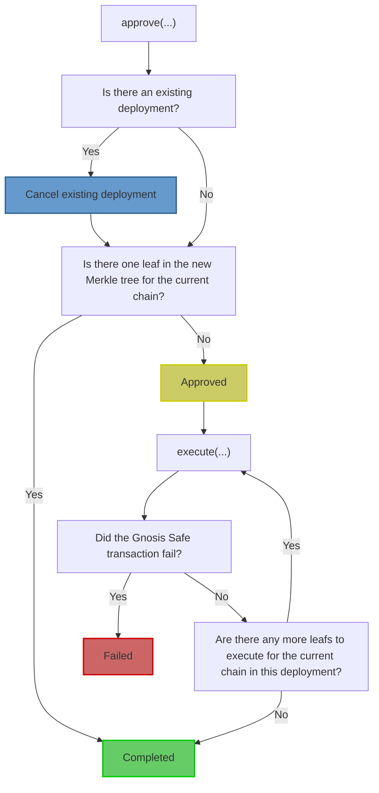

# `SphinxModuleProxy` Contract Specification

The `SphinxModuleProxy` handles the deployment lifecycle for a Gnosis Safe. This includes verifying
Gnosis Safe owner signatures and executing transactions through the Gnosis Safe. Each `SphinxModuleProxy` belongs to a single Gnosis Safe.

A `SphinxModuleProxy` is a minimal, non-upgradeable [EIP-1167](TODO(end)) proxy that delegates calls
to a `SphinxModule` implementation contract. In production, users will interact with a
`SphinxModuleProxy` instead of the `SphinxModule` implementation contract, which is why this
specification describes the expected behavior of the proxy. The implementation contract will be
locked so that nobody can deploy directly through it.

**Vocabulary notes**:
* An _executor_ is an address that has sole permission to execute a deployment in a Gnosis Safe. Normally, deployments will be executed by Sphinx's backend, but the Gnosis Safe owners can specify any executor that they'd like.
* A _user_ is a set of Gnosis Safe owners. We use these terms interchangeably throughout this document.

## Table of Contents

TODO(end)

## Relevant Files

- The interface: [`ISphinxModuleProxy.sol`](TODO(end))
- The implementation contract: [`SphinxModule.sol`](TODO(end))
- Unit tests: [`SphinxModuleProxy.t.sol`](TODO(end))
- Key data structures: [`SphinxDataTypes.sol`](TODO(end))

_Note_: There is no source file for the `SphinxModuleProxy` because we use OpenZeppelin's [`Clones.sol`](TODO(end)) for deploying EIP-1167 proxies.

## Overview

Here are the steps of a standard deployment:

1. The Gnosis Safe owners sign a Merkle root off-chain with a meta transaction.
2. The executor calls the `approve` function on the Gnosis Safe's `SphinxModuleProxy`. This verifies that a sufficient number of Gnosis Safe owners have signed the Merkle root, and sets the Merkle root as "active".
3. The executor calls the `execute` function on the Gnosis Safe's `SphinxModuleProxy`. The `SphinxModuleProxy` routes the user's transactions through the Gnosis Safe. This step may involve multiple transactions for larger deployments.

Since a Merkle root can contain deployments across an arbitrary number of chains, this process will occur on every chain that the owners approved in the first step. There can only be one active Merkle root (i.e. active deployment) in a `SphinxModuleProxy` contract at a time.

**It's impossible for the executor to submit anything that the Gnosis Safe owners have not explicitly approved.**

A Merkle root will always exist in one of the five following states:

1. **Empty**: The Merkle root has not been approved.
2. **Approved**: The Merkle root has been approved by the Gnosis Safe owners, and the `approve` function has been called on the `SphinxModuleProxy`. This Merkle root is now "active".
3. **Cancelled**: An active Merkle root that has been cancelled by the Gnosis Safe owners cannot ever be re-approved or executed.
4. **Failed**: A Merkle root will fail if one of the transactions reverts in the Gnosis Safe. This prevents it from being re-approved or executed.
5. **Completed**: A Merkle root is considered complete after all of the Merkle leafs have been executed on the target chain. Completed Merkle roots can never be re-approved or executed.

We've included a flow chart that explains the deployment process in more detail:

## High-Level Invariants

- There can only be one active Merkle root in a `SphinxModuleProxy` at a time.
- A Merkle root must contain at most one deployment per chain.
- Each leaf in a Merkle tree must be submitted exactly once.
- The leafs in a Merkle tree must be submitted in ascending order on each chain according to the leaf's index.
- The Gnosis Safe owners must be able to cancel an active Merkle root in the `SphinxModuleProxy`.
- The Gnosis Safe owners must be able to cancel a Merkle root that has been signed off-chain, but is not yet active in the `SphinxModuleProxy`.[^1]
- The Merkle proof verification logic must hash the Merkle leaf using the internal [`_getLeafHash` function](TODO(end)).
- It must be impossible to reuse a signed Merkle root in a different `SphinxModuleProxy` that is also owned by the Gnosis Safe.[^2]
- All of the behavior described in this specification must apply to all [Gnosis Safe contracts supported by Sphinx](TODO(end)).

## Function-Level Invariants

#### `function initialize(address _safeProxy) external`

- Must revert this function has already been called.
- Must revert if the input Gnosis Safe proxy is the zero address.
- A successful call must set the Gnosis Safe proxy in the `SphinxModuleProxy`.

#### `function approve(bytes32 _root, SphinxLeafWithProof memory _leafWithProof, bytes memory _signatures) public`

- Must revert if the `SphinxModuleProxy` calls this function, either directly or indirectly (i.e. re-entrancy is not allowed).
- Must revert if the input Merkle root is `bytes32(0)`.
- Must revert if the Merkle root has ever been approved before.
- Must revert if the input Merkle leaf does not yield the input Merkle root, given the input Merkle proof.
- Must revert if the Merkle leaf's type does not equal `APPROVE`.
- Must revert if the Merkle leaf's index does not equal `0`.
- The following conditions apply to the ABI decoded Merkle leaf data:
  - Must revert if the leaf data contains a Gnosis Safe address that does not equal the Gnosis Safe address in the `SphinxModuleProxy`.
  - Must revert if the leaf data contains a `SphinxModuleProxy` address that does not equal the current contract's address (i.e. `address(this)`).
  - Must revert if the leaf data contains a nonce that does not equal the current nonce in the `SphinxModuleProxy`.
  - Must revert if the leaf data contains a `numLeafs` field that equals `0`.
  - Must revert if the leaf data contains an `executor` field that does not equal the caller's address.
  - Must revert if the Merkle root cannot be [executed on an arbitrary chain](TODO(end)) _and_ the leaf data contains a `chainId` field that does not match the current chain ID.
- Must revert if an insufficient number of Gnosis Safe owners have signed the EIP-712 data that contains the input Merkle root.
- A successful call must:
  - Emit a `SphinxDeploymentApproved` event in the `SphinxModuleProxy`.
  - Set all of the fields in the [`DeploymentState` struct](TODO(end)).
  - Increment the nonce in the `SphinxModuleProxy`.
- If there is an existing active Merkle root in the `SphinxModuleProxy`, a successful call must also:
  - Set the `DeploymentStatus` of the _existing_ Merkle root to `CANCELLED`.
  - Emit a `SphinxDeploymentCancelled` event in the `SphinxModuleProxy` using the _existing_ Merkle root.
- If there is a single leaf in the Merkle tree for the current chain, a successful call must also:
  - Set the `DeploymentStatus` of the input Merkle root to be `COMPLETED`.
  - Remove the active Merkle root, preventing it from being approved in the future.
  - Emit a `SphinxDeploymentCompleted` event in the `SphinxModuleProxy` using the input Merkle root.
- If there is more than one leaf in the Merkle tree for the current chain, a successful call must also:
  - Set the `DeploymentStatus` of the input Merkle root to be `APPROVED`.
  - Set the active Merkle root equal to the input Merkle root.

#### `function execute(SphinxLeafWithProof[] memory _leafsWithProofs) public returns (DeploymentStatus)`

- Must revert if the `SphinxModuleProxy` calls this function, either directly or indirectly (i.e. re-entrancy is not allowed).
- Must revert if the input `_leafsWithProofs` array does not contain any elements.
- Must revert if there is no active Merkle root.
- Must revert if the caller is not the executor specified in the `approve` function.
- Must revert if the number of leafs executed for the current Merkle root is greater than the `numLeafs` specified in the `approve` function.
- For each element of the `_leafsWithProofs` array:
  - Must revert if the current Merkle leaf does not yield the active Merkle root, given the current Merkle proof.
  - Must revert if the current Merkle leaf's type does not equal `EXECUTE`.
  - Must revert if the Merkle root cannot be [executed on an arbitrary chain](TODO(end)) _and_ the leaf data contains a `chainId` field that does not match the current chain ID.
  - Must revert if the current Merkle leaf is executed in the incorrect order (i.e. its index isn't correct).
  - Must revert if the transaction has an [insufficient amount of gas](TODO(end)).
  - A successful iteration must:
    - Increment the number of leafs executed for the active Merkle root by `1`.
    - Attempt to execute a transaction in the user's Gnosis Safe using the data in the current Merkle leaf.
    - The call to the user's Gnosis Safe must never revert.
      - Rationale: This would cause the user's deployment to be active indefinitely until they manually cancel it.
    - If the call to the Gnosis Safe is successful:
      - Must emit a `SphinxActionSucceeded` event in the `SphinxModuleProxy`.
    - If the call to the Gnosis Safe is unsuccessful for any reason:
      - Must emit a `SphinxActionFailed` event in the `SphinxModuleProxy`.
    - If the call to the Gnosis Safe is unsuccessful for any reason _and_ the current leaf requires a success:
      - Must emit a `SphinxDeploymentFailed` event in the `SphinxModuleProxy`.
      - Must set the active Merkle root's `DeploymentStatus` equal to `FAILED`.
      - Must remove the active Merkle root, preventing it from being approved in the future.
      - Must exit the `execute` function immediately, returning a `DeploymentStatus` equal to `FAILED`.
- If there are no more leafs to execute for the active Merkle root:
  - Must set the active Merkle root's `DeploymentStatus` equal to `COMPLETED`.
  - Must emit a `SphinxDeploymentCompleted` event in the `SphinxModuleProxy` using the active Merkle root.
  - Must remove the active Merkle root, preventing it from being approved in the future.
  - Must return a `DeploymentStatus` equal to `COMPLETED`.
- If there are more leafs to execute for the active Merkle root:
  - Must return a `DeploymentStatus` equal to `APPROVED`.

#### `function _getLeafHash(SphinxLeaf memory _leaf) internal pure returns (bytes32)`

- Must double-hash the ABI-encoded Merkle leaf.
  - Rationale: We double-hash to prevent second preimage attacks, as recommended by [OpenZeppelin's Merkle Tree library](https://github.com/OpenZeppelin/merkle-tree#standard-merkle-trees).

## Assumptions

### Buggy Executor

A buggy executor can:
* Wait an arbitrary amount of time to approve or execute a deployment that has been signed by the Gnosis Safe owners.
  * Remedy: The Gnosis Safe owners can [cancel the deployment](TODO(end)) at any time.
* Partially execute a deployment.
  * Remedy: Users can batch critical actions into a single call using [`Multicall`](TODO(end)) or Gnosis Safe's [`MultiSend`](TODO(end)). If a deployment stalls, the executor will either execute the batched call, or not.

### Malicious Executor

_Note_: It's impossible for the executor to submit anything that the Gnosis Safe owners have not explicitly approved.

A malicious executor is subject to the same two limitations as a buggy executor. In addition, a malicious executor can take advantage of its privilege as the sole executor of a deployment. There are a variety of ways that it can do this.

Some examples:
* If a deployment relies on the state of an existing smart contract, and if the executor is able to
   manipulate the state of that smart contract, then it could be possible for the executor to
   execute the deployment in a manner that is detrimental to the user. For example, say a deployment
   relies on `existingContract.myBoolean() == true`, otherwise it fails. If the executor is able to
   set `existingContract.myBoolean() == false`, then the deployment will fail.
* The executor can interact with a contract in the same transaction that it's deployed, which can be
   an "unfair advantage" for the executor. For example, if a deployed contract has an open token
   airdrop, the executor can deploy the contract then claim the airdropped tokens in the same
   transaction, before any other account has a chance to claim them.

It's worth reiterating that the Gnosis Safe owners can choose anybody to be an executor, including themselves.

### Malicious Gnosis Safe owner(s)

* A user could attempt to grief the executor by specifying an arbitrarily large gas amount for a transaction,
which would prevent the deployment from being executable.
  * Remedy: This is not a concern because Sphinx has off-chain logic that checks if the gas amount for a transaction is too high.
* A malicious user could pay Sphinx less than the cost of the deployment.
  * Remedy: In practice, this is not a concern because Sphinx has off-chain billing that ensures we're reimbursed for all deployment costs.

### Dependencies

The `SphinxModuleProxy` makes several calls to OpenZeppelin's Contracts library and Gnosis Safe's contracts. We test that the interactions with these contracts work properly in the [unit tests for the `SphinxModuleProxy`](TODO(end)), but we don't thoroughly test the internals of these external contracts. Instead, we rely on the assumption that they're secure and have been thoroughly tested by their authors. These contracts are:
- OpenZeppelin vTODO(end):
  - [`ReentrancyGuard`](TODO(end)): Prevents re-entrancy attacks in the `approve` and `execute` function in the `SphinxModuleProxy`.
  - [`Initializable`](TODO(end)): Prevents the `SphinxModuleProxy`'s `initialize` function from being called more than once.
  - [`MerkleProof`](TODO(end)): Verifies that a Merkle leaf belongs to a Merkle root, given a Merkle proof.
- Gnosis Safe:
  - `Enum` ([v1.3.0](TODO(end)), [v1.4.1](TODO(end))): Contains the types of operations that can occur in a Gnosis Safe (i.e. `Call` and `DelegateCall`).
  - [`GnosisSafe`](TODO(end)): Contains the logic for verifying Gnosis Safe owner signature and executing the user's transactions.

## Footnotes

[^1]: The Gnosis Safe owners can cancel a Merkle root that hasn't been approved on-chain by signing a new Merkle root that has the same nonce, then approving it on-chain. This prevents the old Merkle root from ever being approved.

[^2]: We prevent the same Merkle root from being approved in more than one `SphinxModuleProxy` by including the address of the `SphinxModuleProxy` in the `APPROVE` Merkle leaf, and checking that this field matches the current address in the `SphinxModuleProxy`'s `approval` function.
